# Game Design Document (GDD)
# **Climb the Cat Tree**

- [Game Overview](#game-overview)
- [Story and Narrative](#story-and-narrative)
- [Gameplay and Mechanics](#gameplay-and-mechanics)
- [Levels and World Design](#levels-and-world-design)
- [Art and Audio](#art-and-audio)
- [User Interface (UI)](#user-interface-ui)
- [Technology and Tools](#technology-and-tools)
- [Team Communication, Timelines and Task Assignment](#team-communication-timelines-and-task-assignment)
- [Possible Challenges](#possible-challenges)
- [Basic Pipeline and Features List (to be updated)](#basic-pipeline-will-be-updated-along-the-way)

## Game Overview

Climb the Cat Tree is a fast paced, vertical scrolling arcade platformer. You play as a little mouse that finds herself being chased up a giant cat tree by a cat. Having no way but up, you must platform your way to the top while dodging the cat's swipes and hairballs as well as environmental dangers. This game is reminiscent of classic arcade games like Donkey Kong, as well as mobile games like Doodle Jump, Tomb of the Mask, Downwell and Jump King, following a vertical level design. 

This game is for casual to intermediate gamers, it is intended to be easily picked up but harder to master. Like Jump King it will feature a set level design with layers/levels of increasing difficulty the further you go up and you have no save points. This game may require many tries to figure out but as you build up knowledge and muscle memory, each run becomes easier.

## Story and Narrative

Backstory:

* The game is set in a cat owner’s house or apartment, where there is a mouse trying to obtain cheese as a cat chases it up its cat tree. The main conflict lies between the cat and the mouse, where the cat wishes to capture it, and the mouse wishes to run away while collecting as much cheese as possible.  
* If there is a game over, the cat has captured the mouse, and if the level is complete, the mouse has successfully escaped the cat. 

Characters:

* There are two key characters in the game, the cat and the mouse. They have no particularly deep relationship, but we aim to convey their personalities through our visual depictions.   
* Mouse: Our player character. We designed the mouse to look very cute and small so the player can easily sympathise with it. It is afraid of the cat and eager to obtain cheese and escape\!  
* Cat: The villain character and “owner” of the cat tree. The cat’s presence is consistently large and looming at the bottom of the screen. It enjoys chasing the mouse and would like to capture it. It will be upset if the mouse escapes. 

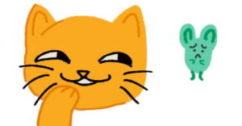

## Gameplay and Mechanics

Player Perspective: 

* The game is a 2.5D third-person vertical scrolling platformer, where the camera continuously scrolls upwards but is fixed horizontally. The player character is always visible on the screen, as long as they do not fall below it, triggering a game over. 

Controls: 

* The controls for the game will be typical for a simple platformer. Where the left and right arrow keys control horizontal movement, and the up key/spacebar control jumps, where a jump goes higher (to an extent) if the player holds the key for longer.   
* The player should also be able to use the arrow keys and the enter key to interact with the menu. 

Progression:

* The player must keep climbing upwards and falling below the screen results in a game over (the mouse getting caught by the cat\!).   
* Collision with the cat’s paw, hairballs, or other obstacles can cause damage to health, where if the player loses all health points, there is a game over.  
* As the player progresses through a level, it will become more difficult with more obstacles in the way.   
  * (Optional) - The scrolling of the camera speeds up. Depending on progress throughout a level or between different level difficulties.   
* There are no save points throughout the level(s). If the player has a game over, they should be able to return the main menu or try the level again.   
* If the player successfully completes the level by reaching the level end at the top of the cat tree, they unlock the next level. There are 3 levels in total (TBC), each with increasing difficulty.  
* The player can obtain points by collecting items such as cheese. We clearly display the score at the end to a player and give a rating (e.g. gold for if all or almost every cheese was collected).  
* The player should want to keep playing to perfect their score or challenge themselves through the increasing difficulty throughout the game. It may require multiple attempts to beat or improve their previous scores as they improve their muscle memory, making it more satisfying when they finally reach that goal. 

Gameplay Mechanics:

* As a platformer, the key mechanic of the game is platforming. The player is able to jump from platform to platform to ascend through the level and escape the enemy cat constantly at the bottom of the screen.   
* (Optional) Aside from the basic standard platform the player can jump on, there are also moving platforms that move side to side horizontally, as well as breaking platforms that disappear slowly after being stepped on once, motivating the player to keep moving and being aware of the level environment.   
* Enemies and obstacles:  
  * Cat paws appear from the edge of the screen at intervals, causing damage if touched.   
  * Hairballs can roll across platforms as moving obstacles the player must dodge. 

## Levels and World Design

#### World and Presentation

The entire game takes place on a huge cat climbing tree. From the perspective of a little mouse, this ordinary piece of furniture turns into a towering maze. 

- The game is presented in 2.5D,  
- The world is modelled and illuminated in 3D,  
- The player's movement is restricted to a 2D plane \- left and right, and up.  
- The camera is fixed and set to automatically scroll up, creating sustained time pressure.
- At the first level, the scroll speed is slower (about 1.8u/s, or 18cm/s in reality), and gradually speeds up as the level progresses, reaching 2.6u/s (26cm/s) at the final level.

* If a player drops from the bottom edge of the screen, they will instantly die.   
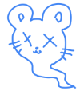

* The game has no mini-map, and navigation is entirely dependent the current screen visuals, i.e.
    *  the colour of the platform,  
    *  the guidance of light and shadow,   
    * and the arrangement of collectibles.

Starting from the ground (Easy Difficulty), players see warm carpeted platforms with soft lighting. 

* As the climb continues (Medium Difficulty), the environment gradually darkens: shadows stretch, and scratches and damage appear on wooden surfaces.   
* When reaching the uppermost "Cat’s Domain" (Hard Difficulty), the atmosphere is oppressive, the shadows are thick

The victory flag in the distance glows slightly at a height of 3 to 3.5 meters, guiding the player forward.   
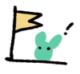

#### Level layout and progress

The entire game is divided into **three vertical phases**, each of which introduces new mechanics and increases the challenge.  
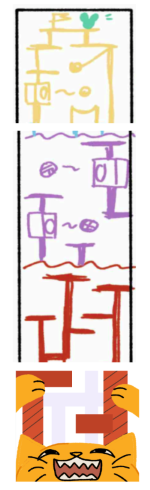

**Level 1 \- “The Scratching Post” (Easy):**

* The platform width is 26-30 cm, and the vertical height difference is no more than 20cm.  
  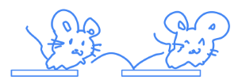
* The maximum jump height of the mouse is about 24cm, so all platforms are within reach.  
* The collectibles (**cheese**) are placed in conspicuous positions for teaching the mechanics to the player. 

  

* Cat attack pattern: Cat PAWS appear approximately every 3 seconds. They come out from the sides of the screen to swipe at the player, where if the player touches the paws, they will take damage.   
  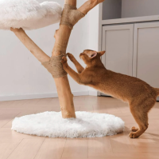(Source of inspiration \- scenario simulation)  
* (Optional, TBC) Checkpoints: The goal is to reach the first "safe resting spot," a wider platform with brighter light.

 

**Level 2 \- "The Carpeted Jungle" (Medium):**

* The platform width is reduced to 22-25 cm, and the horizontal spacing is close to the limit (30-35 cm).  
* Introduce the **breaking platform**: It collapses within 0.6 seconds of being stepped on, forcing the player to keep moving.  
   
* The **yarn ball** began to appear, rolling at a speed of about 25cm/s and bouncing between the platform and the wall.  
  
* The environment darkens with the **Phong model** for illumination and shade, and the diffuse reflection’s hue is cooler.  
* The cat paw attack frequency is increased to once every 2 seconds, alternating between the left and right edges.

 
**Level 3 \- "Cat's Domain" (Hard):**

*  Introduce the **moving platform**, which swings left and right about 12cm, for 1 second.  
  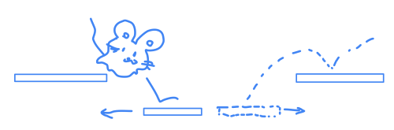
* Danger Stack: Cat paw attack speeds up to once every 1.4 seconds, while three hairballs may appear on the screen.  
* **Feathers and potions** appear near the limit distance, encouraging players to take risks to obtain them.

      

* Ambience: Thick shadows, scratch textures, faint flashes of distant flags.  
* The total height is about 30-35u (3-3.5m). Reach the top flag to win and earn a bronze/silver/gold rating based on the amount of cheese collected.

   
To keep the rhythm, each stage has a "**checkpoint**": a wider platform (above 32cm), where no enemies are generated, and the camera pauses briefly for players to rest.

#### Game objects and interactions

**Platform:**

* **Standard platform:** Stable and standing, carpet or wood grain, 22-30 cm wide.

  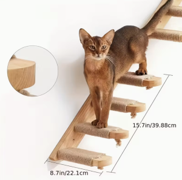(Size comparison with the enemy \- cat)

* **Breaking platform:** Faded colour, with cracks; It collapses 0.6 seconds after being stepped on, and the transparency gradually decreases.  
* **Moving platform:** Swinging left and right, with an animation similar to hanging cat toys, slightly moving the player when standing.

 

**Enemies**

* **Cat paw**: Extends from the edge of the screen. The attack determination takes approximately 0.3 to 0.4 seconds. Touching it will directly deplete health or fail.  
* **Yarn ball**: Radius about 6cm, rolling speed 25-30 cm/s, bounces when encountering obstacles.

 

**Collectibles**

* **Cheese**: Glowing yellow, core scoring item. There will be around 1 piece of cheese every 3 meters to collect. 

  

* **Feathers**: Provide the player the ability to double jump for a 1.5 seconds. 

  

* **Magic potions**: Provide 1.5 seconds of invisibility and immunity to the next enemy damage.

  

#### Physics and Rules

The game obeys a simplified physics model designed to feel consistent and fair.

**Basic Parameters (TBC)**

* Gravity: 30 u/s² (3m/s²) to make jumps snappy but still allow about 0.8s of airtime.  
* Jump: Initial velocity cap about 12u/s, maximum jump height 24cm, maximum horizontal distance 38cm. These values directly inform platform spacing.  
* Movement speed: about 48cm/s on the ground, about 32cm/s in the air. Friction and air control are tuned so the mouse feels agile but not floaty.  
* Collision volume: The player uses a capsule collider with a radius of 3.5cm and a height of 12cm, which fits the size of a little mouse (hazards cause knockback or direct health loss, while falling below the screen or losing all health results in instant game over).

 
#### Rules

* Bumping into cat paws or yarn balls \-\> losing health (a total of 3 lives/chances) or being knocked off.  
  
    
* Run out of health or drop off the screen \-\> game over.  
* Camera’s upward drift (scrolling pressure), staying still \-\> being pushed off-screen \-\> defeated.  
  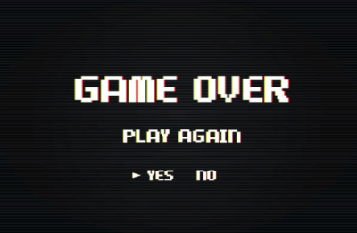

#### Rendering and visibility

The look of the world is reinforced with standard rendering techniques:

* **Lighting model**: With Phong reflection, with ambient light for base mood, diffuse shading for carpet and wood textures, and specular highlights for dangerous objects like paws and hairballs.  
  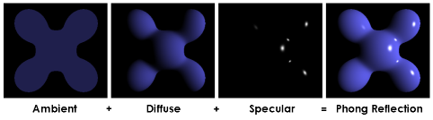  
* **Shading frequency**: Phong Shading on a per-pixel basis to keep highlights crisp and consistent.  
  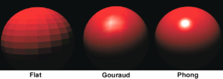
* **Shadows**: Start with simple blob projections for performance; shadow mapping can be added later for more realism.  
* **Texture**: Use Unity’s default texture support.  
* **Visibility**: Use Z-buffer depth testing to ensure correct occl	usion as the camera scrolls upward.  
  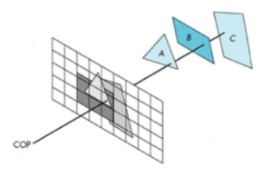

#### Integration with Story and Gameplay

* The Cat Tree is the cat’s lair: every scratch, yarn ball and paw strike reminds players of the predator below.   
* Vertical climbing mirrors the escalating tension of being pursued.   
* Collecting cheese gives a sense of challenge and completion, while feathers and potions are power ups that will aid your thrilling escape.

The combination of background design and narrative tension (the approaching cat) ensures urgency in each climb and builds the frantic atmosphere of a tiny creature's struggle for survival against overwhelming odds.

## Art and Audio
* Art Style:   
  The overall art style is minimal and clean, emphasising simple colour palettes and geometric compositions. The colour scheme features soft, low-saturation tones of pink, beige, and light blue, accented with selective contrasting colors to create a playful yet harmonious atmosphere. The game environment (the cat tree) is built from basic geometric forms blocks, cylinders, and spheres arranged in a modular, building-block fashion. The spatial presentation adopts a 2.5D perspective, blending the surreal architectural quality of Monument Valley with the gentle, storybook-like illustration, resulting in visuals that feel dreamlike.  
  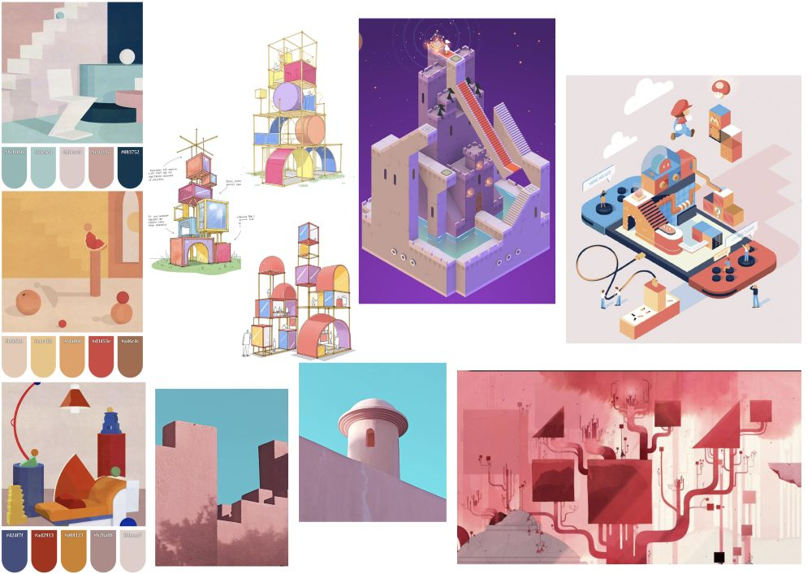
  **Background:**  
  The background adopts the use of gradients inspired by the colours of the aurora. As the game progresses from Level 1 to Level 3, the palette transitions from light and bright to deeper tones.  
  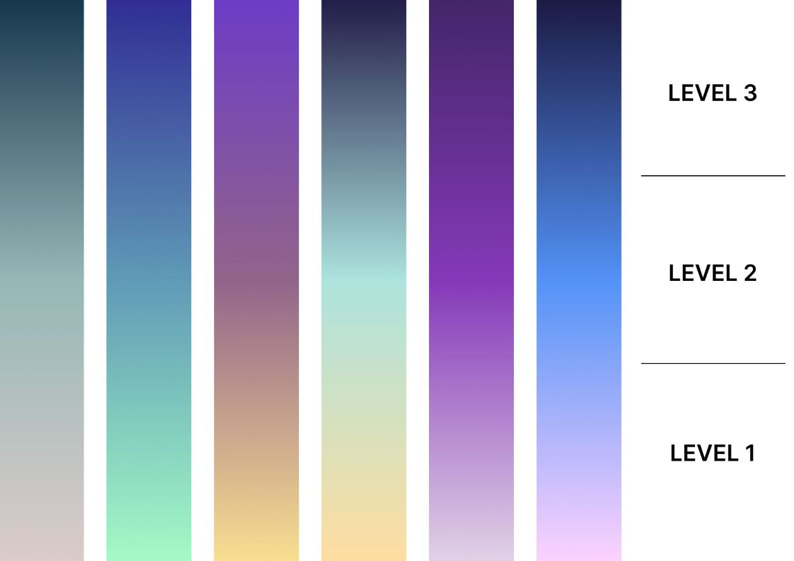
* Sound and Music: 

**Background Music**

The background music is progressive. At lower levels, it begins with light and simple melodies. As the player climbs higher, the music gradually layers additional instruments, intensifies rhythm, and builds tension, mirroring the increasing difficulty and stakes of the game. The overall tone is dreamy and airy.

#### Sound Effects：
| No. | Description | Category | License | Resource |
| :---- | :---- | :---- | :---- | :---- |
| 01 | Menu Selection Click | Sound Effects | CC0 | [https://freesound.org/s/171697/](https://freesound.org/s/171697/) |
| 02 | Mouse jump | Sound Effects | CC0 | [https://freesound.org/s/362328/](https://freesound.org/s/362328/) |
| 03 | Mouse jump | Sound Effects | CC0 | [https://freesound.org/s/199690/](https://freesound.org/s/199690/) |
| 04 | Cat paw swipe | Sound Effects | CC BY | [https://freesound.org/s/811961/](https://freesound.org/s/811961/) |
| 05 | Collecting | Sound Effects | CC BY | [https://freesound.org/s/342750/](https://freesound.org/s/342750/) |
| 06 | Collecting | Sound Effects | CC BY | [https://freesound.org/s/337049/](https://freesound.org/s/337049/) |
| 07 | Losing health | Sound Effects | CC BY | [https://freesound.org/s/593909/](https://freesound.org/s/593909/) |
| 08 | Losing health | Sound Effects | CC0 | [https://freesound.org/s/458867/](https://freesound.org/s/458867/) |
| 09 | Game over (failure) | Sound Effects | CC0 | [https://freesound.org/s/159408/](https://freesound.org/s/159408/) |
| 10 | Game over (failure) | Sound Effects | CC BY | [https://freesound.org/s/439890/](https://freesound.org/s/439890/) |
| 11 | Game clear (success) | Sound Effects | CC0 | [https://freesound.org/s/580310/](https://freesound.org/s/580310/) |
| 12 | Game clear (success) | Sound Effects | CC BY | [https://freesound.org/s/505426/](https://freesound.org/s/505426/) |
| 13 | Game clear (success) | Sound Effects | CC0 | [https://freesound.org/s/456966/](https://freesound.org/s/456966/) |
    

* Assets:   
  The artistic assets planned for the game include models, textures, sound effects, and music. Some basic models and materials will be sourced from the Unity Asset Store, while sound effects will primarily come from Freesound and other royalty-free libraries. Custom assets such as the cat tree structure or unique collectibles will be created using Blender tools.

## User Interface (UI)

**Functionality:**

* **Main Menu**: Displays the game title and a poster image as the visual centerpiece, with a prominent “Play” button in the center to start the game. A "Settings button" is located in the top-right corner, while a "Quit button" is placed in the top-left corner, allowing players to adjust options or exit before starting.  
  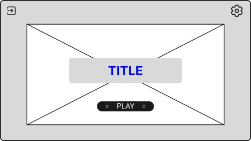  
* **Setting Menu**: Consists of three modules:

  **Settings**: Allows players to adjust the game’s audio, including background music and sound effects volume.

  **Help**: Provides basic instructions for the game, including controls (e.g., move, jump) and core rules.

  **About Us**: A brief introduction to the development team, giving players context about the creators behind the game.

  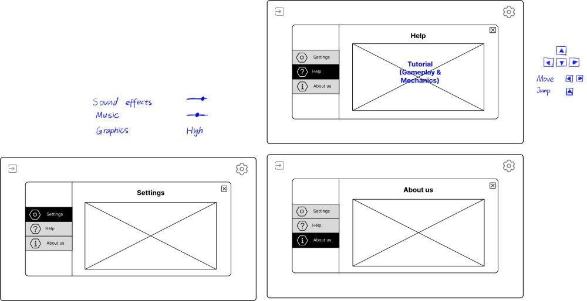

* **Game Page**: Shows the player’s "score and health" at the top, with pause and settings buttons on the right side. The pause menu allows players to continue, restart, or quit.  
  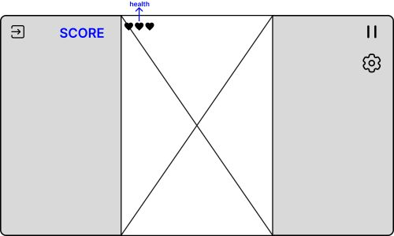  
  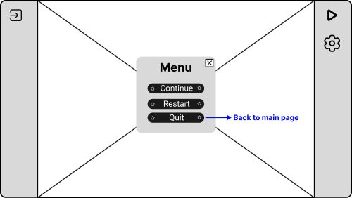
* **Game Over Page**: Displays the final score, with options to restart or quit the game. Different animations and sounds are triggered depending on the outcome.  
  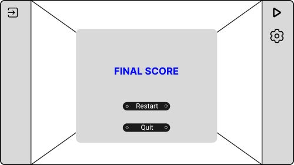

**Overall wireframe:**

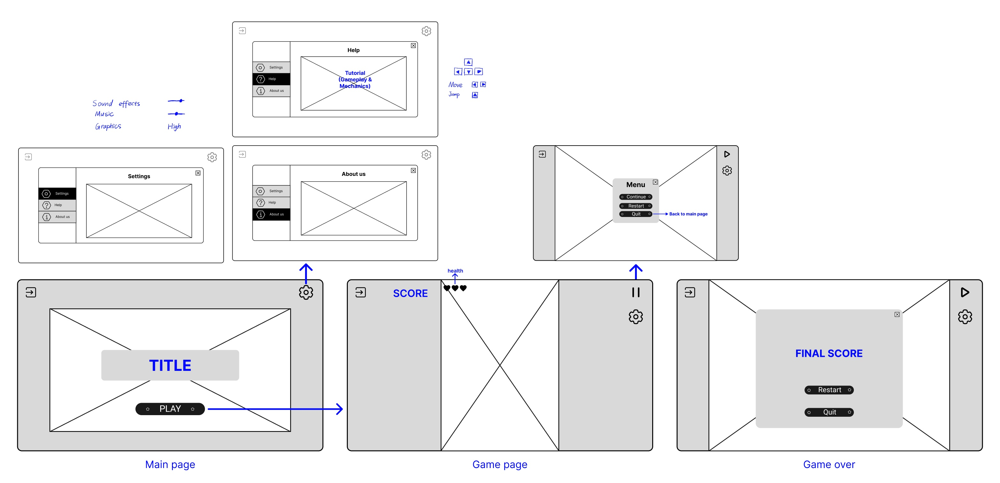

My figma link: [https://www.figma.com/design/1C7LFy0FOPTZGOgALJbptz/Untitled?node-id=0-1\&t=6O7wZRBVEpcyyfui-1](https://www.figma.com/design/1C7LFy0FOPTZGOgALJbptz/Untitled?node-id=0-1&t=6O7wZRBVEpcyyfui-1)

## Technology and Tools

Core development & Collaboration:
* [**Jira**](https://student-team-whp5n23c.atlassian.net/jira/software/projects/KAN/boards/1?atlOrigin=eyJpIjoiYjBjZWQyOTc3ODZmNGQ2NWJhNGFjNmFmN2FhOGEyOTMiLCJwIjoiaiJ9) for tracking task progress and allocations  
* **Github** for version control and collaboration  
* **Unity 6.1x** as our game engine  
* **Discord** for regular communication

Art and UI:
* **Procreate** and **Clip Studio Paint** for 2D art/animation and textures  
* **Figma** for UI designs and prototyping  
* For 3D models, we will try to find what we need from the [**Unity Asset Store**](https://assetstore.unity.com/?category=3d%2Fprops&free=true&orderBy=1) and other open source 3D model sources. Otherwise, we may use **Blender** for 3D modelling.  
  * E.g. for cat tree models

Audio:
* Sound effects from [SoundBible](https://soundbible.com/) and [FreeSound](https://freesound.org/)  
  * E.g. for jumping, collision, damage and attack sound effects

* Music from [Bensound](https://www.bensound.com/) and [OpenGameArt](https://opengameart.org/). Try to find music with an “arcade-style”.  

## Team Communication, Timelines and Task Assignment

Team communication: 
* Frequent communication over Discord. We hold weekly meetings to update each other of our progress and set the goals for the next week.

Timelines: 
* We take an agile-inspired software development approach, where we gather a list of requirements and organise them to be complete within week long sprints throughout the semester. We continuously review the progress of these tasks and see if we need to adjust what we aim to get done by each deadline. 

Task Assignment: 
* We will use [Jira](https://student-team-whp5n23c.atlassian.net/jira/software/projects/KAN/boards/1?atlOrigin=eyJpIjoiYjBjZWQyOTc3ODZmNGQ2NWJhNGFjNmFmN2FhOGEyOTMiLCJwIjoiaiJ9) as a project management tool to delegate tasks between ourselves and track progress. 

## Possible Challenges
All of us are unfamiliar with Unity and C#, although have some experience with over object oriented programming languages such as Java. The current semester is anticipated, and has been, quite busy, and will likely be something to be mindful of as we plan our timelines. 

We aim to overcome these challenges with consistent communication between us, where can easily help fill the gaps on each other's knowledge or help find resources. 

In the future, we will decide a testing pipeline, whether manual or automatic, to ensure we do not miss any obvious bugs or problems when integrating with the previous code.

#

### Basic Pipeline (will be updated along the way):  
**Milestone 2: GDD Due 15th of September**

* Character movement

**Milestone 3: Team member evaluation 25th September**

* Level mechanics  
* Level design  
* Enemy mechanics (the cat)  
* Basic 3d platform models  
* Shading/particles
*(27 days to implement)*

**Milestone 4: Evaluation Demo, 13 October** 

* Animation  
* Sound design and music  
* Game testing
(7 days)*

**Milestone 5: Gameplay Video, 20 October, 5.00 pm**

* Evaluation report
*15 days*

**Milestone 6: Final Submission, Wednesday 5 November**  
***Maximum development time \- 50 days***

#

#### Features List
Associated Jira [here.](https://student-team-whp5n23c.atlassian.net/jira/software/projects/KAN/boards/1?atlOrigin=eyJpIjoiYjBjZWQyOTc3ODZmNGQ2NWJhNGFjNmFmN2FhOGEyOTMiLCJwIjoiaiJ9)

* Character movement \- Cindy  
  * Left right  
  * Jumping  
* Level design \- Cindy  
* Level mechanics \- Emily  
  * Basic platforms 
  * Camera scrolling  
    * Add a speed parameter  
  * Health points  
  * Collectable cheese for points  
  * Menus and UI  
    * Level UI (health, score)  
    * Game over  
    * Level win (display score)  
    * Main menu and level select  
  * Moving platforms  
  * Breaking platforms  
* Enemy mechanics \- the cat\!  
  * Cat at bottom of screen (take damage if hit? Or instant game over)  
  * Cat paws   
  * Hairballs   
* Shading and particles \- Sunny, Xingyu  
  * Shader 1
  * Shader 2  
  * Particle effect (at least one)   
* Sound design and music \- Emily 

* Art and animation \- Cindy 

