## Game Design Document (GDD)
# Climb the Cat Tree

#### Table of Contents
1. [Game Overview](#1-game-overview)
2. [Story and Narrative](#2-story-and-narrative)
3. [Gameplay and Mechanics](#3-gameplay-and-mechanics)
4. [Levels and World Design](#4-levels-and-world-design)
5. [Art and Audio](#5-art-and-audio)
6. [User Interface](#6-user-interface-ui)
7. [Technology and Tools](#7-technology-and-tools)
8. [Basic Pipeline](#8-basic-pipeline)
9. [Features List](#9-features-list)

### 1\. Game Overview

Climb The Cat Tree is a fast paced, vertical scrolling arcade platformer. You play as a little mouse that finds herself being chased up a giant cat tree by a cat. Having no way but up, you must platform your way to the top while dodging the cat's swipes and hairballs as well as environmental dangers. This game is reminiscent of classic arcade games like Donkey Kong and challenging platformers such as Kaizo Mario World and Jump King, as well as mobile games like Tomb of the Mask, Downwell, following a vertical level design. While inspired by classic and modern platformers, Climb The Cat Tree aims to stand out through its distinct themes, dynamic tension and stylised expressive movement design.

This game is for casual to intermediate gamers, it is intended to be easily picked up but harder to master. It will feature a set level design with layers/levels of increasing difficulty the further you go up and you have no save points. This game may require many tries to figure out but as you build up knowledge and muscle memory, each run becomes easier.

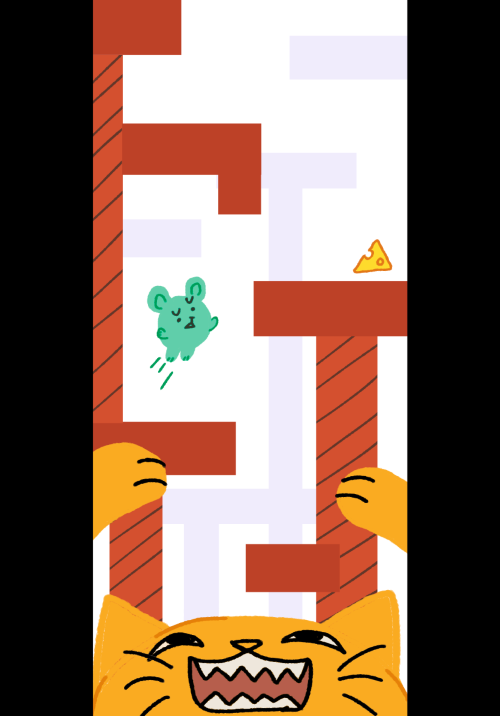

#### 

### 2\. Story and Narrative 

Rather than focusing on deep storytelling, Climb The Cat Tree uses a charming, straightforward narrative to give purpose and personality to the player’s climb.

#### 2.1 Backstory:

* The game is set in a cat owner’s house or apartment, where there is a mouse trying to obtain cheese as a cat chases it up its cat tree. The main conflict lies between the cat and the mouse, where the cat wishes to capture it, and the mouse wishes to run away while collecting as much cheese as possible.  
* If there is a game over, the cat has captured the mouse, and if the level is complete, the mouse has successfully escaped the cat. 

#### 2.1 Characters:

There are two key characters in the game, the cat and the mouse. They have no particularly deep relationship, but we aim to convey their personalities through our visual depictions. 

Mouse: Our player character. We designed the mouse to look very cute and small so the player can easily sympathise with it. It is afraid of the cat and eager to obtain cheese and escape\!

Cat: The villain character and “owner” of the cat tree. The cat’s presence is consistently large and looming at the bottom of the screen. It enjoys chasing the mouse and would like to capture it. It will be upset if the mouse escapes. 

### 3\. Gameplay and Mechanics

#### 3.1 Player Perspective:

This game is a 2.5D third-person vertical scrolling platformer, where the camera follows the player upwards while the horizontal perspective remains fixed.

#### 3.2 Controls:

The controls for the game will be typical for a simple platformer. Use the arrow keys or WASD to move, and press the spacebar to jump.

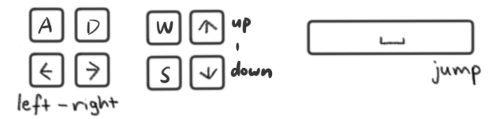

#### 3.3 Progression:

* Players must **keep climbing upwards** to reach the **victory flag**.  
* **Beware of yarn balls\!** Colliding with them will damage your health. If the player’s reaches 0, they will die  
* There are **no save points** throughout the entire level. If the player dies, they shall automatically return to the starting point to recommence play.  
* As players progress through the level, it becomes increasingly challenging, presenting more obstacles.  
* The player can **obtain points by collecting cheese**. We clearly display the score at the end to a player and give a **rating**.  
* The player should want to keep playing to perfect their score or challenge themselves through the increasing difficulty throughout the game. It may require multiple attempts to beat or improve their previous scores as they improve their muscle memory, making it more satisfying when they finally reach that goal. 

#### 3.4 Gameplay Mechanics:

* The core gameplay mechanic is platforming. The player jumps **from platform to platform** to ascend through the level and reach the **victory flag**.   
* Aside from the **basic standard platform** the player can jump on, there are also **moving platforms** that move side to side horizontally or vertically, **breaking platforms** that disappear slowly after being stepped on once, and climbable **ropes**. These elements will encourage players to keep moving and remain aware of the level's environment.  
* Obstacles:  
  * The **Cat** will emerge from below to chase the player. If  the player fails to escape, they will die.  
  * **Hairballs** can roll across platforms as moving obstacles the player must dodge. 

### 4\. Levels and World Design

#### 4.1 World and Presentation

**4.1.1 Concept Overview**

The game world is set on a cat tree, viewed from the perspective of a small mouse. Everyday furniture is reshaped into a massive and dangerous vertical world. The player's objective is to continuously climb upwards, escaping the cat pursuing from below while collecting cheese spread along the path.

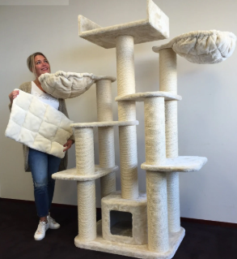 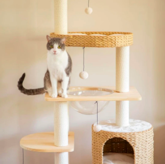

**4.1.2 Dimensionality and Perspective**  
The game employs a 2.5D style:

* Visually: Scenes are constructed using 3D models  
* Interactively: Player movement is confined to a plane (horizontal and vertical directions)

This approach maintains 3D spatial depth while ensuring platforming mechanics remain straightforward and precise.

**4.1.3 Camera System**  
The game employs a vertical follow camera that tracks the character.

* The camera consistently centres the character  
* Players cannot fall off-screen  
* The camera's smooth transition speed synchronises with character movement, preventing abrupt camera jumps  
* The camera cannot fall below the constantly rising cat at the bottom of the level

Unlike the initial version, the camera no longer automatically scrolls upwards but instead follows the player's movement path entirely. This design reinforces the impression that ‘the player controls the pace of progression’, ensuring challenges stem from terrain and enemies rather than time pressure.

**4.1.4 Environmental Composition**  
The setting is the cat owner's apartment, with the cat tree serving as the core structure of the main level.  
From bottom to top, the environment undergoes gradual visual and emotional shifts:

* Bottom Zone (Warm Zone): Soft lighting and warm tones, with carpets and cushioned platforms creating a sense of security.  
* Middle Zone (Transition Zone): Features a purple tunnel and wooden bridge, with cooler lighting and darker shadows.  
* Upper Zone (Cold Zone): Dim lighting and oppressive atmosphere heighten the cat's presence.

The tonal transition employs a Warm-to-Cold Gradient throughout the level, dynamically adjusted by scene lighting. 

As the game progresses, the screen edges gradually darken with a vignette effect to heighten the tension of being pursued.

**4.1.5 Lighting and Shader**  
The entire scene is rendered using the ToonPhongWithOutline Shader:

* Toon Phong Lighting preserves a sense of depth  
* The outline highlights the edges of objects, ensuring characters and scenery remain distinct within the 2.5D perspective  
* Lighting colour shifts with elevation, visually reinforcing the narrative rhythm where ‘climbing higher \= greater danger’

This cartoon-style rendering preserves the structural integrity of the 3D scene while ensuring visual consistency with character models such as the mouse and cat, forming a recognisable unified style.

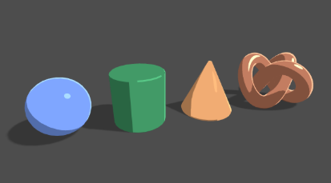

#### 4.2 Level Layout and Progress

**4.2.1 Design Intent**  
The level design of Climb the Cat Tree emphasizes vertical flow and accessibility while maintaining challenge. Players climb and discover new platforming or enemy mechanics; the combination of the two slowly increases the difficulty. Some may find themselves reaching the top with ease, but collecting every cheese introduces deeper platforming precision and light exploration, striking a balance between approachability and mastery.

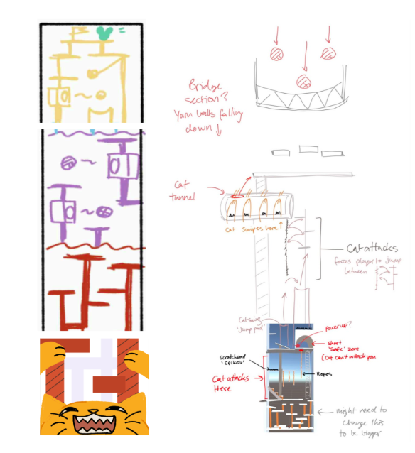

**4.2.2 Spatial Composition**  
The entire level is constructed on a single cat tree extending to the ceiling, with platforms and obstacles forming a complete vertical gameplay space.

Each level possesses distinct spatial and visual characteristics:

| Image| Stage  |
| :---- | :---- |
| 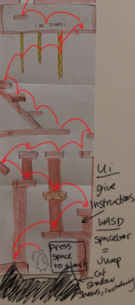 | **Stage 1 \- Ground Section:** Scenery primarily features carpet and soft furnishings in warm colour tones. Tutorial Stage: Contains only standard platforms and collectable cheese. Progressively introduces Jump Pads and Rope Climbs to familiarise players with basic movement and vertical climbing mechanics. The player has a large head start to familiarise themself with the mechanics before the cat emerges and starts chasing them.  |=
| 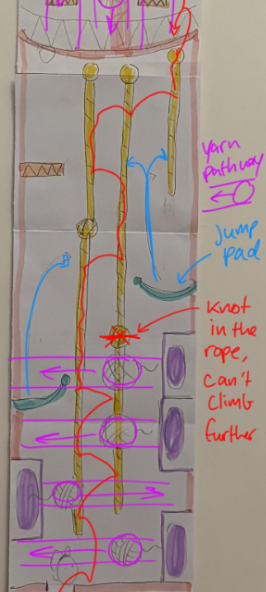 | **Stage 2 \- Transition Section:** Platforms become more widely spaced and spread out. New mechanics introduced: Moveable Platforms increase timing difficulty Yarn Balls launch from boxes and roll across platforms, creating dynamic threats Ambient lighting grows colder with heightened shadow contrast, symbolising the approaching threat of the cat. |
| 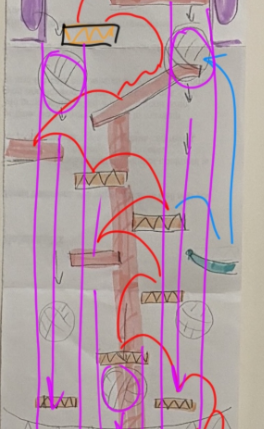 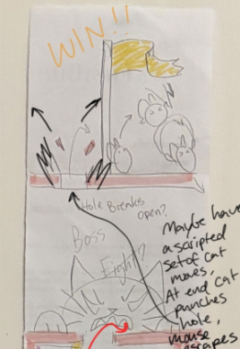 | **Stage 3 \- Upper Section:** New additions: Breakable Platforms and Cat Paw Attacks require mastery of rhythm and timing. The cat appears more frequently at the bottom of the camera frame, significantly heightening the sense of threat. The Victory Flag serves as a visual guide, emitting a soft glow against the dark background, symbolising the ‘hope of escape’. |

**4.2.3 Progression Logic**

* Player progression naturally follows the cheese placement route upwards from the bottom, with cheese distribution serving both as scoring incentives and navigational cues.  
* Each new mechanic is introduced through safe scenarios before combining with existing mechanics to form compound challenges. For example:  
  * Jump pads first appear in tutorial zones, later combining with moving platforms in subsequent areas  
  * Yarn balls initially follow a single track, later alternating with cat paw attacks  
* Attack frequency and platform instability jointly form a ‘Rhythm Escalation Curve’: Players must increasingly balance reaction speed with strategic judgement as progressing upwards.

**4.2.4 Visual and Emotional Rhythm**  
The visual rhythm evolves naturally with the climbing progression:
* Lower Level \- Bright, secure, low contrast, evoking familiarity and control.  
* Middle Level \- Purple hues heighten unease, accelerating the pace.  
* Upper Level \- The environment grows colder, shadows deepen, and the attack by the cat creates the psychological pressure peak.

Through the progressive layering of colour, lighting, and spatial rhythm, the player experiences an emotional journey from relaxed exploration to tense escape during a complete climb.

#### 4.3 Game Objects and Interactions

**4.3.1 Design Overview**  
Game objects are organised into three primary categories:

1. **Platforms** \- used for movement and rhythm control.  
2. **Collectibles** \- driving player objectives and scoring mechanics.  
3. **Enemies and Hazards** \- form the core of threats and challenges.

These elements collectively construct the ‘Climbing Flow’ within vertical space, achieving visual and gameplay integration through rhythmic layout, interactions, and light-and-shadow guidance.

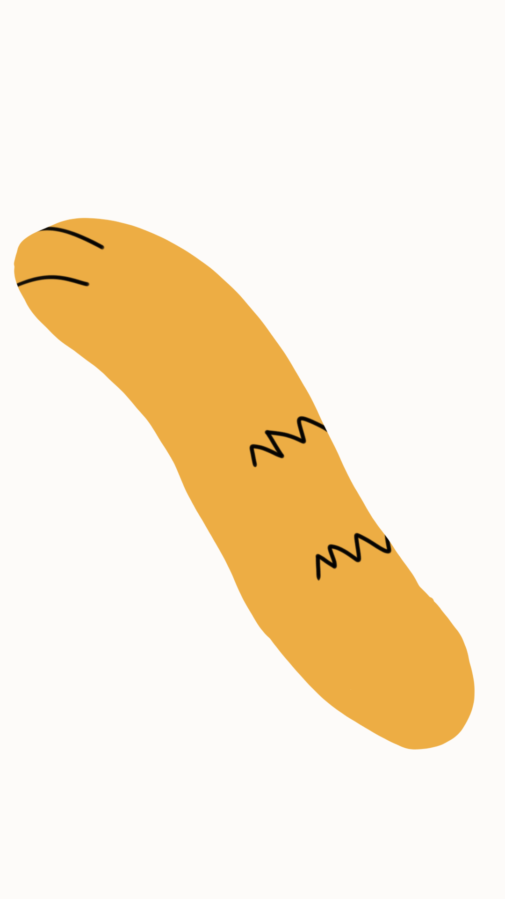

**4.3.2 Platforms**

**Standard Platform**

* Materials: Home furnishings such as carpets and timber.  
* Function: Provides secure landing points, serving as fundamental path units within the game.  
* Layout logic: Densely placed at lower levels, sparsely distributed at higher levels, facilitating tutorial sequences and pacing adjustments.  
* Visual representation: Features soft surfaces and distinct edges to aid players in judging jump landing points.

**Moveable Platform**

* Timing of introduction: Second stage.  
* Function: Periodically shifts left and right, creating dual challenges of timing and positioning.  
* Interaction logic: Character stands while platform slides slightly, requiring judgment of movement timing to execute jumps.

**Breakable Platform**

* Timing of Introduction: Third stage.  
* Function: Collapses shortly after the character steps on it, compelling continuous movement.  
* Visual Presentation: Reappears briefly after disappearing due to collapse.

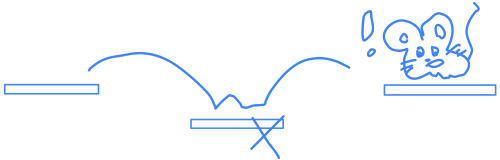

**Jump Pad**

* Function: Enables players to jump higher than usual, aiding in crossing height differences or dangerous terrain.  
* Teaching function: Used early on to guide vertical movement rhythm.  
* Visual representation: Bright, luminous blocks that stand out among the cat tree environment.

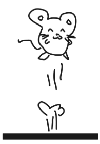

**Rope**

* Function: Enables players to climb or slide down, adding multi-level route options.  
* Visual representation: Suspended between platforms, character enters climbing action state when grabbing.

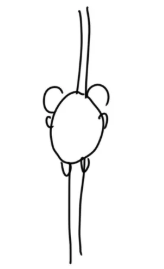

**4.3.3 Collectibles**

**Cheese**

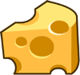

* Function: A collectible, used for scoring and navigation.  
* Layout Logic: Distributed along the main path, guiding the player's path upwards. But some are placed in challenging positions to challenge the player  
* Response Mechanism:  
  * Each piece of cheese collected gains points  
  * when reaching the flag endpoint, a 1-3 star rating is awarded based on the number collected.  
* Visual Presentation: Luminous yellow translucent material with slight rotational animation to enhance appeal.  
* Sound Effects: A cheerful ‘ding’ sound, consistent with reward response styling.

**4.3.4 Enemies and Hazards**

**Yarn Ball**

* Introduction Phase: Stage Two.  
* Generation Method: Shoot out from fixed boxes, one at a time.  
* Behaviour Logic: Rolls along platforms, persists until leaving the screen.  
* Function: Creates moving obstacles, testing the player's rhythm judgement.  
* Visual Presentation: Plush surface texture with soft shadows; moderate speed with stable trajectory.  
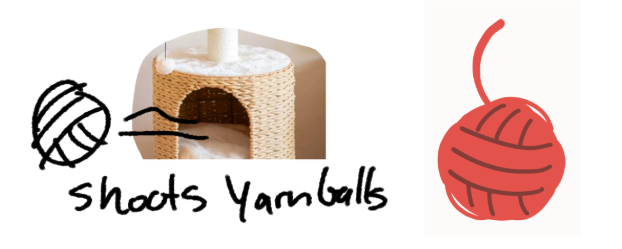

**Cat Paw**

* Introduction Phase: Stage Three.  
* Behaviour Logic: Periodically extends from screen edges to attack, inflicting damage upon contact.  
* Function: Creates instant reaction challenges, generating psychological pressure through rhythmic appearances.  
* Visual Presentation: Animated with dynamic motion to enhance perceived threat.

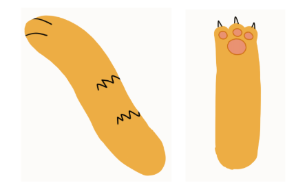

**Cat**

* Presentation: Cartoon cat head animation at screen bottom, glaring at the player.  
* Behaviour Logic: After a certain period from the start the cat will spawn, and commence pursuit of the player. Should the character make contact with the cat, the player will take damage.  
* Function: Visually reminds the player ‘do not stop’, acts a pressure to keep the player frantic and moving

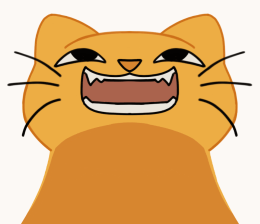

**4.3.5 Health and Damage System**

**Health Points**

* Players start with three health points.  
* Each attack from a yarn ball, cat paw, or bottom cat costs one point.  
* Game over is triggered when health is empty.

**Damage Response**

* Character injury animation (red) \+ Health Points UI reduces by one heart \+ Sound effect cue.  
* Combines visual and auditory responses to immediately alert players to danger.

**Game Over Conditions**

* Health Points reduced to zero.

**Game Win Conditions**

* Player touches the flag and a post-game screen displays score rating based on cheese quantity.

#### 4.4 Physics and Rules

**4.4.1 Design Philosophy**

The movement style is designed to feel more deliberate and weighty. This outcome, though less agile than initially envisioned, contributes to a greater sense of tension and precision during play. The contrast between swift intent and careful control reinforces the game's focus on timing and spatial awareness, rewarding players who adapt to its rhythm.

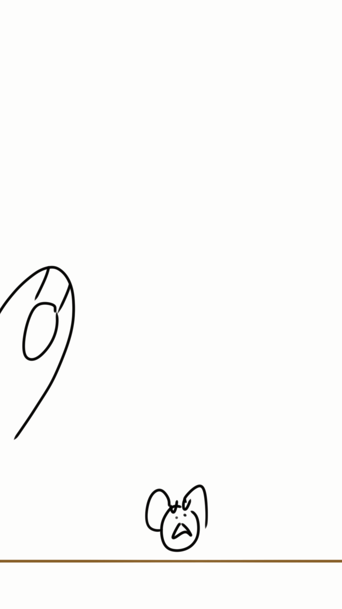

**4.4.2 Movement and Ground Interaction**

**Control Logic**

* Horizontal movement employs a linear acceleration response mechanism, ensuring characters react instantly to input without appearing frozen.  
* When characters are airborne, horizontal movement speed is slightly reduced to convey air resistance and inertial control.  
* All physical motion is locked to the Z-axis, keeping characters confined to a single 2.5D plane.

**Ground Check**

* Each frame employs a spherical detection to determine whether the character is grounded.  
* The grounded state drives jump mechanics, animation transitions, and gravity compensation logic.  
* If the character is not grounded, additional gravity is continuously applied to accelerate descent and enhance the handling's solid feel.

**Sprite Flip**

* The character's orientation is flipped in according to input direction to maintain visual consistency. This flip affects visual presentation only and does not alter collision logic.

**4.4.3 Jumping and Boost Mechanics**

**Base Jump**

* The player can press the spacebar while on the ground to jump, with the duration of the press determining the jump height. A short press results in a light jump, while a long press results in a high jump (variable jump height)

**Hold Jump Booster**

* When players stand on a ‘Jump Pad’ and jump,  
* Holding the jump button briefly increases the character's ascent speed, extending the jump trajectory.  
* This mechanism does not replace the standard jump, but rather provides a perceptible ‘extension’ to the original jump curve.  
* It aims to encourage players to master higher platform areas through rhythm control, enhancing the sense of mastery and balancing risk with reward.

**4.4.4 Rope Climb System**

**Activation and Locking**

* When the character contacts a collision object marked as ‘Rope’, they automatically enter climbing mode.  
* In this mode, the character aligns with the rope's centre, locking the Z-coordinate and horizontal position, allowing only vertical movement.

**Climb Behaviour**

* Gravity and inertial physics are disabled during climbing. Movement is directly driven by player input.  
* Pressing the spacebar allows the character to disengage from the rope at any time. After leaving the rope, collision detection with the rope is temporarily disabled to prevent immediate reattachment.

**Visual and Physical Response**

* During climbing, the character's posture and animations automatically transition to a climbing state

**4.4.5 Health and Damage Logic**

**Health System**

* Players start with three hearts, which decrease by one each time damage is taken.  
* Damage sources include:

  1\. Yarn Ball rolling collisions

  2\. Cat Paw attacks

  3\. The cat's touch area at the bottom of the screen

**Invincibility Frames**

* After taking damage, the player briefly enters an invincibility state to prevent consecutive hits  
* During this period, the character plays a hurt animation (red)

**Death and Freeze**

* When health reaches zero, the character enters a death state:  
* A death animation triggers  
* All physical movement freezes  
* Collision detection is disabled to prevent further interaction  
* The game enters the Game Over phase and automatically resets the character to the ground to begin the next round
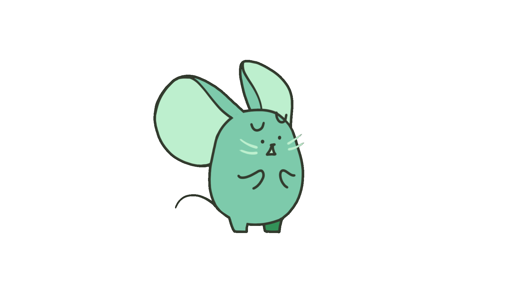

**4.4.6 Camera and Boundary Rules**

**Camera Behaviour**

* The camera always smoothly follows the character, maintaining centred positioning and automatically adapting to vertical movement rhythms.  
* Automatic scrolling is no longer employed, ensuring the character never falls out of the screen's field of view.

**Boundary Conditions**

* The lower edge of the screen represents the cat's threat zone.  
* When the character touches this area, they will immediately take damage or trigger a game over.  
* There is no hard boundary at the top, and reaching the flag at the top triggers level completion and score calculation.

**4.4.7 Physics Consistency and Fairness**

* All physical actions (movement, jumping, climbing, taking hits) are implemented within a unified physics layer to prevent conflicts between different mechanics.  
* Regardless of the player's location, the direction of gravity, inertial response, and collision detection methods remain consistent.  
* Game pacing is driven by player actions rather than system-imposed time pressure, ensuring all failures stem from visible, learnable rules.

### 5\. Art and Audio

This work employs a **non-photorealistic rendering (NPR)** technique to achieve a **cel-shaded** cartoon aesthetic. Utilising outlines and segmented lighting, it presents **low-poly, hand-drawn scenes and characters**.(Inspired by LoZ: WindWaker)

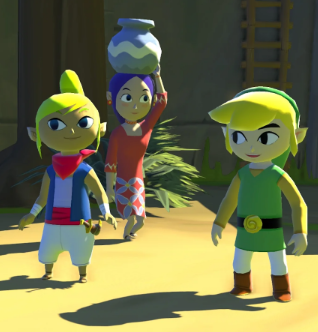

The game environment (the cat tree) is built from **basic geometric** forms blocks, cylinders, and spheres arranged in a modular, building-block fashion reminiscent of frames in classic arcade games. The spatial presentation adopts a 2.5D perspective with bright, vibrant, saturated colours, reminiscent of Paper Mario. The animation and 2D art style is cartoony, reminiscent of early 2000s cartoons with bold outlines and colours. This use of colour and styles is fun and punchy but also serves to better separate the layers of the background enhancing visual clarity. 
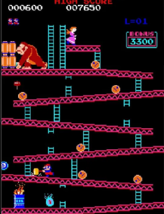 

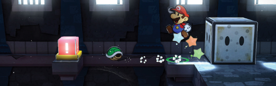

#### 5.1 Background Music：

The background music has a fast tempo and frantic energy to match the hectic action of the game.

#### 5.2 Sound Effects：

Sound effects provide immediate feedback for player actions and also communicate game events and environmental cues, making interactions feel responsive and satisfying. We have added sound effects to the following components and player states:

* Jump pad  
* Break platform  
* Cat meow  
* Collecting cheese  
* Footsteps (when player flip)  
* Mouse squeak when hurt  
* Mouse death sound	

#### 5.3 Assets:

The artistic assets planned for the game include environment models, textures, sound effects, and music. Some basic models and materials will be sourced from the Unity Asset Store, while sound effects will primarily come from Youtube and other royalty-free libraries. Custom assets such as the cat tree structure or unique collectibles will be created using Blender tools.

Mouse and Cat: Designed by ourselves. The mouse's various states were animated using Procreate.
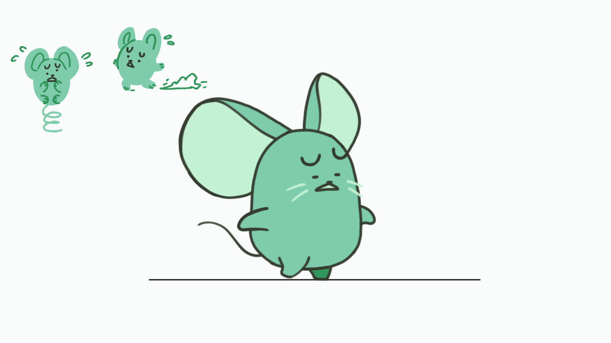

Cat tree: The components and platform of the cat tree were primarily modelled in Blender.
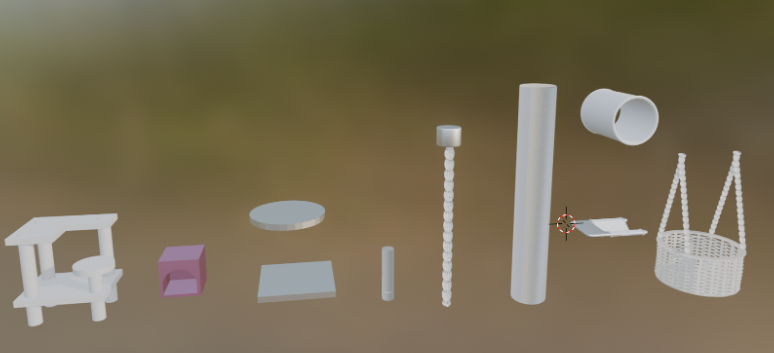

Background music, sound effects, background models, and decorative elements were sourced from externally downloaded assets.

| No. | Description | License | Resource |
| :---- | :---- | :---- | :---- |
| 01 | Background music | CC BY 3.0 | [https://www.youtube.com/watch?v=mOXginnvZ4A](https://www.youtube.com/watch?v=mOXginnvZ4A) |
| 02 | Sound effects | CC0 | [https://assetstore.unity.com/packages/audio/sound-fx/free-casual-game-sfx-pack-54116\#description](https://assetstore.unity.com/packages/audio/sound-fx/free-casual-game-sfx-pack-54116#description) |
| 03 | Background models and Decorative elements | Standard Unity Asset Store EULA； License type: Extension Asset | [https://assetstore.unity.com/packages/3d/props/food/food-free-low-poly-3d-models-pack-260726\#description](https://assetstore.unity.com/packages/3d/props/food/food-free-low-poly-3d-models-pack-260726#description) |
| 04 | Bridge model | Standard Unity Asset Store EULA； License type: Extension Asset | [https://assetstore.unity.com/packages/3d/environments/rope-bridge-3d-222563](https://assetstore.unity.com/packages/3d/environments/rope-bridge-3d-222563) |
| 05 | Crumple sound effect | Free for use under the Pixabay Content License | [https://pixabay.com/sound-effects/crumble-2-82156/](https://pixabay.com/sound-effects/crumble-2-82156/)  |
| 06 | Bounce sound effect | Free for use under the Pixabay Content License | [https://pixabay.com/sound-effects/054883-bounce-38937/](https://pixabay.com/sound-effects/054883-bounce-38937/)  |

### 6\. User Interface (UI)

#### 6.1 Overall wireframe:

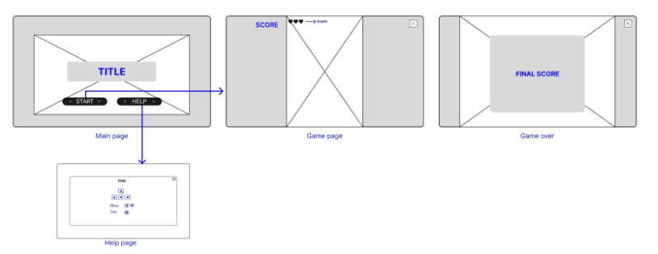

#### 6.2 Functionality:

* Main Page: Displays the game title and a poster image as the visual centerpiece, with “Start” button and “Help” button in the center. The Start button links to the game page. The Help button links to the game instructions.   
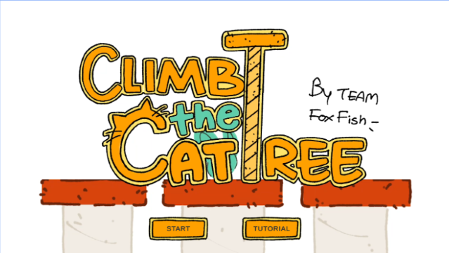
* Help Page: Shows game instructions.  
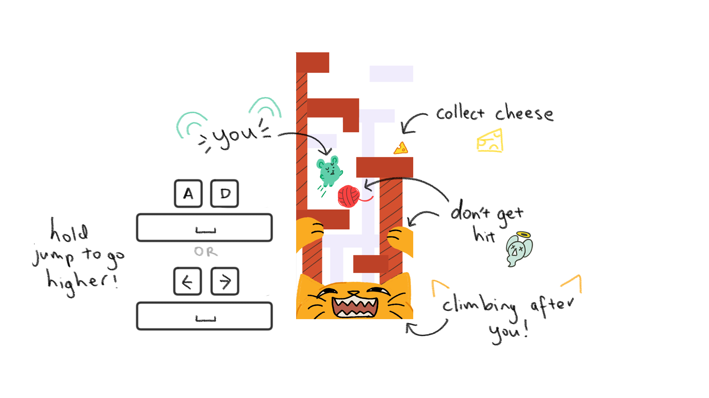
* Game Page: Shows the player’s score and health at the top, with quit button on the right side.
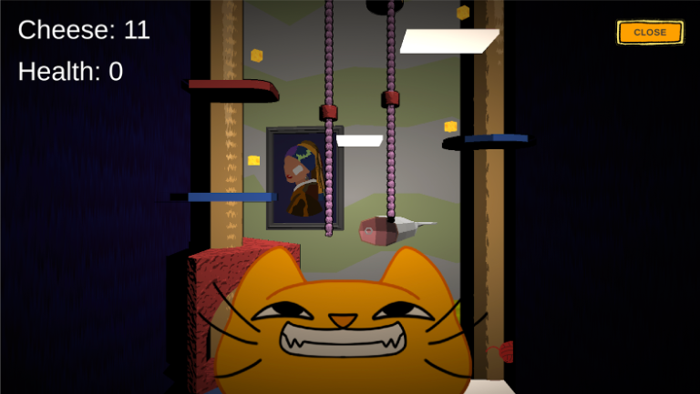

* Game Over: Displays the final score, with options to quit the game.
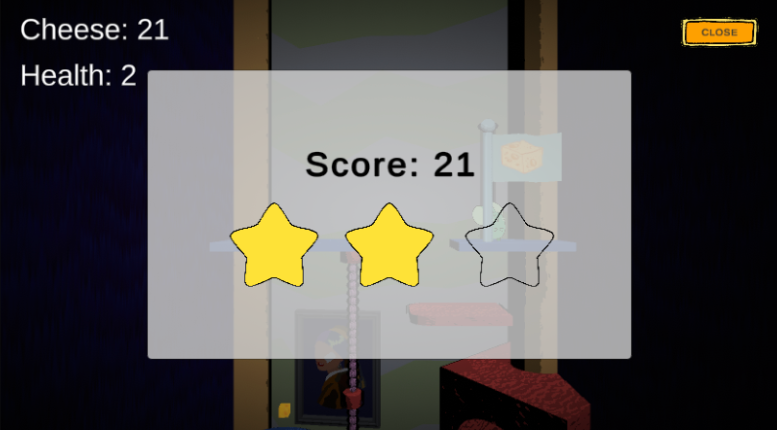

### 7\. Technology and Tools

Core development & Collaboration:

* [**Jira**](https://student-team-whp5n23c.atlassian.net/jira/software/projects/KAN/boards/1?atlOrigin=eyJpIjoiYjBjZWQyOTc3ODZmNGQ2NWJhNGFjNmFmN2FhOGEyOTMiLCJwIjoiaiJ9) for tracking task progress and allocations  
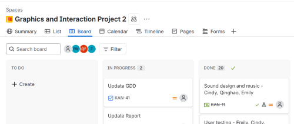
* **Github** for version control and collaboration  
* **Unity 6.1x** as our game engine  
* **Discord** for regular communication

Art and UI:

* **Procreate** and **Clip Studio Paint** for 2D art/animation and textures  
* **Figma** for UI designs and prototyping  
* For 3D models, we will try to find what we need from the [**Unity Asset Store**](https://assetstore.unity.com/?category=3d%2Fprops&free=true&orderBy=1) and other open source 3D model sources. Otherwise, we may use **Blender** for 3D modelling.  
  * E.g. for cat tree models

Audio:

* Sound effects from [**SoundBible**](https://soundbible.com/) and [**FreeSound**](https://freesound.org/)  
  * E.g. for jumping, collision, damage and attack sound effects  
* Music from [Bensound](https://www.bensound.com/) and [OpenGameArt](https://opengameart.org/). Try to find music with an “arcade-style”.
* Adobe Audition for minor audio editing

Gameplay Video:

* **OBS** for game recording  
* **DaVinci Resolve** for video editing

#### Team Communication, Timelines and Task Assignment

Team communication: 

* Frequent communication over Discord. We hold weekly meetings to update each other of our progress and set the goals for the next week.

Timelines: 

* We take an agile-inspired software development approach, where we gather a list of requirements and organise them to be complete within week long sprints throughout the semester. We continuously review the progress of these tasks and see if we need to adjust what we aim to get done by each deadline. 

Task Assignment: 

* We will use [Jira](https://student-team-whp5n23c.atlassian.net/jira/software/projects/KAN/boards/1?atlOrigin=eyJpIjoiYjBjZWQyOTc3ODZmNGQ2NWJhNGFjNmFmN2FhOGEyOTMiLCJwIjoiaiJ9) as a project management tool to delegate tasks between ourselves and track progress. 

### 8\. Basic Pipeline

**Milestone 2: GDD, 15 September**

* Character movement (run and jump)

*Milestone 3: Team member evaluation 25 September*

* Level mechanics  
* Level design  
* Enemy mechanics (the cat)  
* Basic 3d platform models  
* Shading/particles

**Milestone 4: Evaluation Demo, 13 October** 

* Animation  
* Sound design and music  
* Game testing 

**Milestone 5: Gameplay Video, 20 October**

* Final polish  
* Evaluation report

**Milestone 6: Final Submission, 5 November**

*Milestone 7: Team member evaluation, 7 November*

*Milestone 8: Team member evaluation reflection, 9 November*

### 9\. Features List

* Character movement \- Cindy  
  * Left right  
  * Jumping  
* Level design \- Cindy  
* Level mechanics \- Emily, Xinyu, Qinghao  
  * Basic platforms  
  * Camera scrolling  
    * Add a speed parameter  
  * Health points  
  * Collectable cheese for points  
  * Menus and UI  
    * Level UI (health, score)  
    * Game over  
    * Level win (display star rating)  
    * Main menu and tutorial panel  
  * Moving platforms  
  * Breaking platforms  
  * Climbing rope  
  * Bounce pads  
* Enemy mechanics \- the cat\!  
  * Cat at bottom of screen (take damage if hit? Or instant game over)  
  * Cat paws   
  * Yarn balls   
* Shading and particles \- Qinghao, Xinyu  
  * Shader 1 \- Toon Phong with outline  
  * Shader 2 \- Waving flag  
  * Particle effect \- Cheese collection  
* Sound design and music \- Emily  
  * Sfx for everything (jumping, getting hit, cat paw, collecting cheese, completing end level)  
  * Arcade style music. Something kind of whimsical but with urgency  
* 2D Art and animation \- Cindy  
* 3D Art and animation \- Qinghao  
  * \+ some models from Unity Asset Store
  