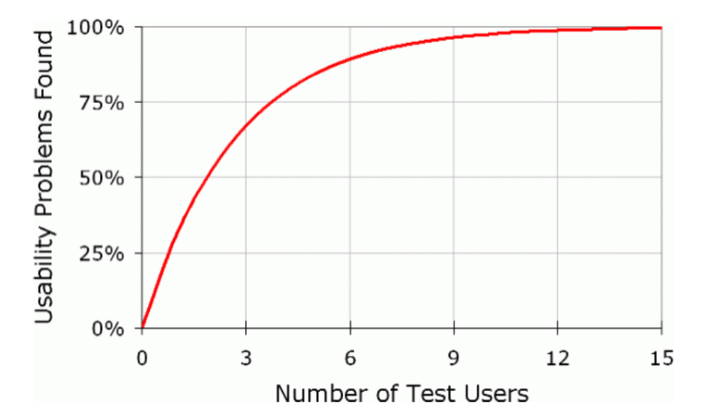

# **Project 2 Report**

## **Table of Contents**

* [Evaluation Plan](https://github.com/Qinghao-F?tab=repositories#evaluation-plan)  
* [Evaluation Report](https://github.com/Qinghao-F?tab=repositories#evaluation-report)  
* [Shaders and Special Effects](https://github.com/Qinghao-F?tab=repositories#shaders-and-special-effects)  
* [Summary of Contributions](https://github.com/Qinghao-F?tab=repositories#summary-of-contributions)  
* [References and External Resources](https://github.com/Qinghao-F?tab=repositories#references-and-external-resources)

## Evaluation Plan
### Introduction

   This report focuses on testing usability and functionality of the system and identifying user experience issues in Climb The Cat Tree, a fast-paced vertical scrolling platformer. Players assume the role of a mouse being chased by a cat, dodging claws, fur balls, and environmental dangers along an ever-ascending path. Targeted at casual to moderately experienced players, the game pursues an “easy to learn, hard to master” approach. It employs fixed level design and a high replayability loop without save points, aiming to foster skill growth through learnable patterns and repeated attempts.  
     
   We employed one observational method (Post-task Walkthrough) and one inquiry method (Semi-structured Interview) to evaluate the extent of system functionality and effect of interface on user. We will recruit 5 participants for each method and provide actionable design modification directions based on the results to support version iterations.

### Methods
   #### 2.1 Post-task Walkthrough
   **Why use Post-task Walkthrough?**  
   Post-task Walkthrough (PTW) is a technique employed to elicit reliable, reusable and reflective user behaviour immediately following uninterrupted task completion (FAIR Consulting Group, 2021\). We selected this method to avoid disrupting participants' full gaming experience, whilst observing their natural conduct during gameplay.  
     
   **Data collection**  
   Within each task, both quantitative behavioural data and qualitative process notes are concurrently collected (refer to Appendix 2). Quantitative data facilitates direct comparison of task difficulty, learning cost, and tolerance for error. Qualitative notes aid in post-task analysis to pinpoint ‘intentions/expectations/obstacles at the time’. The moderator records key events, participants' body language, and micro-expressions to support follow-up questioning and problem attribution.  
     
   Tools: screen recording tools; audio recording tools; notes (Appendix 2).  
     
   **Procedure**  
   Before the evaluation, the participants were provided with a consent form (Appendix 1). Subsequently, under the moderator's guidance, the participant performed four designated tasks. Upon completing the tasks, the participant was required to respond to the moderator's probing questions regarding key events. The entire evaluation process, encompassing task completion and the debriefing session, lasted approximately 30 minutes, with the time commitment having been agreed upon beforehand.

   #### 2.2 Semi-structured Interview

   **Why use Semi-structured Interview?**

   Semi-structured interviews strike a balance between consistency and flexibility. They employ a “pre-arranged list of topics” but are “implemented in a flexible manner", ensuring respondents address research-relevant issues while allowing follow-up questions(Jennings, 2005\). This approach facilitates capturing detailed insights into player confusion, and usability issues during evaluations.

   **Data collection**

   Design core questions by reference to the 10 general principles for interaction design (Nielsen, 1994). Systematically gather participants' subjective experiences regarding onboarding, operational feel, feedback clarity, difficulty pacing, and overall enjoyment, while identifying actionable improvement opportunities (refer to Appendix 3).
   
   Tools: screen recording tools; audio recording tools; questions (Appendix 3).

   **Procedure**

   Prior to the interview, participants were provided with a consent form (Appendix 1). Subsequently, under the moderator's guidance, participants completed four designated tasks. Upon task completion, participants were requested to undertake the interview, encompassing background information and core questions with follow-up inquiries. The entire process lasted approximately 30 minutes, with the duration having been mutually agreed beforehand.

###  Selection of tasks
   We have devised four tasks for the participants, ranging from simple to complex, which will involve and focus on the playability and user experience of this game:

   Task 1: Complete the basic movement and jumping tutorial.  
   
   Task 2: Collect all the cheese and complete Level 1 without losing any health.  
   
   Task 3: Collect all the cheese and complete Level 2 without losing any health.  
   
   Task 4: Collect all the cheese and complete Level 3 without losing any health.  
   
### Selection of participants

   We chose to use 5 participants for each method. According to Nielsen (2000), it is recommended to stop usability testing after the fifth user. Beyond this point, the likelihood of encountering repeated issues increases, and by testing five users, you can uncover approximately 85% of the findings.  
   

*Fig.1 Curve showing why you only need to test with five users*

For both methods, we employed identical criteria to select participants. Each participant group comprised two subject matter experts and three “life experience” users. Subject matter experts contributed domain-specific knowledge and expertise, enriching the assessment process with established industry standards to ensure comprehensiveness and credibility. The “life experience” users were actual product users who provided valuable insights into usability issues and user perspectives based on real-world experience. Including participants with diverse backgrounds and expertise facilitated a more comprehensive assessment, capturing a broader range of usability issues and generating holistic recommendations. This approach ensured diverse viewpoints were considered throughout the evaluation, resulting in a more robust and user-centred assessment of the game's usability and user experience.

**Table 1\. Showing our participants**

| Category | Numbers | Description |
| :---- | :---- | :---- |
| Expert | 2 | Game designer/ engineer |
| Lived experience user   | 1 | Novice: Have limited experience with platform jumping. |
|  | 1  | Intermediate: Possesses a degree of experience, capable of completing basic and some advanced levels. |
|  | 1 | Advanced: Highly experienced with stable execution, able to recognise and exploit advanced mechanics. |

**Recruitment method:** Ask friends and  friends of friends (snowball method).

### Analysis Plan
   We employ the thematic analysis method proposed by Braun and Clarke (2006), which is widely applied in HCI research. This approach aims to systematically identify, analyse, and present “patterned meanings” within data, enabling a structured and detailed description of the material.  

   It comprises six stages:  
   1. Familiarisation with data: Repeatedly read PTW notes and semi-structured interview transcripts, recording preliminary observations.  
   2. Initial coding: Assign concise codes (labels) to salient information. Simultaneously cross-validate with task-quantified data to prioritise design modifications.  
   3. Theme search: Aggregate similar codes into candidate themes (clustered by similarity).  
   4. Theme review: Assess internal consistency and inter-theme differentiation to refine the thematic map.  
   5. Definition and naming: Clarify each theme's scope and boundaries, assigning distinct labels.  
   6. Report drafting: Select representative excerpts (e.g., verbatim interview quotes), align themes with research objectives, and construct coherent narratives.

### Timeline and Responsibilities

| Milestone | Responsibility |
| :---- | :---- |
| 12/10/2025 | Qinghao: Complete the evaluation plan outline Cindy, Emily, Xinyu: Detailed the evaluation plan |
| 19/10/2025 | Cindy, Emily: Finish Post-task Walkthrough evaluation Qinghao, Xinyu: Finish interview |
| 26/10/2025 | All Team Members: Apply thematic analysis to analyse the data and generate findings |
| 02/11/2025 | All Team Members: Make changes to the game based on the results |

## Evaluation Report

TODO - see specification for details

## Shaders and Special Effects

TODO - see specification for details

## Summary of Contributions

TODO - see specification for details

‌

### Appendix 1: Consent Form

**What is the project about?** We are conducting user research to evaluate a platform-jumping game prototype (Climb the Cat Tree) developed by a student team. This study aims to understand players' genuine experiences with the tutorial, controls, feedback, and difficulty pacing, while identifying usability and user experience issues. During the session, you will complete several tasks, followed by reviewing short clips and discussing your impressions with the researcher. If you don’t mind spending 30 minutes with us, we would greatly appreciate your help\!

**May we have your permission to record?** Sometimes, it is difficult to recall accurately what you said during the evaluation. Thus, we would like to get your permission to audio and screen record you in our study. The purpose of this is to help us remember better, so that we can base our conclusions on an accurate understanding of your words and actions. If you agree to our private use of the recordings, in no circumstance would your words or image be used in a commercial setting without first contacting you for permission.

**One last note…** We would like to let you know that we are grateful for your help in our study. However, if at any point during the study you feel like stopping, please let us know. Your participation is totally voluntary and no questions will be asked for your withdrawal.

**May we have your consent?**

☐Yes, I agree to participate in this study and grant permission to use the audio and screen recording of this interview for internal project purposes.

Name: \_\_\_\_\_\_\_\_\_\_\_\_\_\_\_\_\_\_\_\_\_\_\_\_\_\_\_\_\_\_\_\_\_\_\_\_\_\_\_\_\_\_\_\_\_\_

Signed: \_\_\_\_\_\_\_\_\_\_\_\_\_\_\_\_\_\_\_\_\_\_\_\_\_\_\_\_\_\_\_\_\_\_\_\_\_\_\_\_\_\_\_\_\_\_

Date: \_\_\_\_\_\_\_\_\_\_\_\_\_\_\_\_\_\_\_\_\_\_\_\_\_\_\_\_\_\_\_\_\_\_\_\_\_\_\_\_\_\_\_\_\_\_\_\_

### Appendix 2: Template for Post-task Walkthrough Notes (per participant)

Table 1\. Basic information

| Participant | Device | Self-Reported Level (Novice/Intermediate/Advanced) | Handedness (Right / Left / Both) | Date |
| :---- | :---- | :---- | :---- | :---- |
|  |  |  |  |  |

Table 2\. Behaviour Data

| First success time (s) | Task 1: Task 2: Task 3: Task 4: |
| :---- | :---- |
| Total time (s) | Task 1: Task 2: Task 3: Task 4: |
| Number of attempts | Task 1: Task 2: Task 3: Task 4: |

Table 3\. Process notes  
**Observation Dimensions:**  
**Key events**: Falls/impacts/stuck points, route alterations, repeated tentative attempts, pauses, abandoned attempts  
**Body language**: Noticeable forward/backward leaning, deep breathing, whispered comments  
**Micro-expressions**: Sighs/frowning/surprise reactions

| Task ID | Event type | Reply notes |
| :---- | :---- | :---- |
|  |  |  |
|  |  |  |
|  |  |  |
|  |  |  |
|  |  |  |

### Appendix 3: Interview Questions

Important Notes: Respect and protect the privacy of interviewees. Request permission to retain audio and written materials.

**Part A: Basic information (before doing the tasks)**  
1\. Platformer Level (Novice / Intermediate / Advanced)  
2\. Primary Device  
3\. Frequency of playing games over the last months. ( 0/ 0-5/ 5-10/ \>10)  
4\. Handedness (Right / Left / Both)  
5\. How confident are you in judging the correct timing for jumps? (0: not at all; 5: very)  
6\. What were your expectations of this type of platformer game before you started?

**Part B: Core questions**  
**Visibility of system status**  
1\. When you collect cheese or lose health, can you immediately know the outcome? What feedback do you rely on to know?

2\. Do you like the current placement of the score and health bars?

**Match between system and the real world**  
3\. Are the icons, naming conventions, and symbols in the game intuitive?  
	No: If you were to choose a more natural name/icon, what would it be?

**User control and freedom**  
4\. Do you have any means of recovery after an erroneous operation (such as a quick redo or returning to a checkpoint)?

**Consistency and standards**  
5\. Does the control key mapping suit your preferences? Which element deviates from common standards, leading to errors?  
Unfamiliar: If you could change just one key, which one would you alter?

**Error prevention**  
6\. In which situations are users most prone to accidental touches or misjudging the timing?  
	At which stage would you prefer an earlier or more prominent warning?

7\. In which scenarios would providing a prompt or secondary confirmation prove most beneficial?

### Recognition Rather than Recall

8\. Are the prompts during operation enough? Are there moments when one must rely on memory?  
At which point were prompts most needed? What kind of prompts were required?

**Aesthetic and minimalist design**  
9\. Is the screen information just right? At what points is there too much/too little information, or does it obstruct or distract?  
If you could remove or add just one layer of information, where would you choose?

**Help and documentation**  
10\. If you forget a particular operation or mechanism, do you know where to quickly find the answer?  

#

### References and External Resources

FAIR Consulting Group. (2021). *Using System Usability Scale and Post-Task Walkthrough to Test Usability and Functionality of Systems*. [https://faircg.com/code-stories/using-system-usability-scale-and-post-task-walkthrough-to-test-usability-and-functionality-of-systems/\#elementor-toc\_\_heading-anchor-5](https://faircg.com/code-stories/using-system-usability-scale-and-post-task-walkthrough-to-test-usability-and-functionality-of-systems/#elementor-toc__heading-anchor-5).

Jennings, G.R. (2005). *Semistructured Interview \- an overview | ScienceDirect Topics*. www.sciencedirect.com. Available at: [https://www.sciencedirect.com/topics/psychology/semistructured-interview](https://www.sciencedirect.com/topics/psychology/semistructured-interview).

Nielsen, J. (1994). *10 Heuristics for User Interface Design*.Nielsen Norman Group. [https://www.nngroup.com/articles/ten-usability-heuristics/](https://www.nngroup.com/articles/ten-usability-heuristics/).

Nielsen, J. (2000, March 18). Why You Only Need to Test with 5 Users. *Nielsen Norman Group.* [https://www.nngroup.com/articles/why-you-only-need-to-test-with-5-users/](https://www.nngroup.com/articles/why-you-only-need-to-test-with-5-users/)

Braun, V. and Clarke, V. (2006). Using Thematic Analysis in Psychology. *Qualitative Research in Psychology*, 3(2), pp.77–101. doi: [https://doi.org/10.1191/1478088706qp063oa](https://doi.org/10.1191/1478088706qp063oa).
