# Project 2 Report

#### Table of Contents

* [Evaluation Plan](#evaluation-plan)  
* [Evaluation Report](#evaluation-report)  
* [Shaders and Special Effects](#shaders-and-special-effects)  
* [Summary of Contributions](#summary-of-contributions)  
* [References and External Resources](#references-and-external-resources)

## Evaluation Plan {#evaluation-plan}

### 1. Introduction

   This report focuses on testing usability and functionality of the system and identifying user experience issues in Climb The Cat Tree, a fast-paced vertical scrolling platformer. Players assume the role of a mouse being chased by a cat, dodging claws, fur balls, and environmental dangers along an ever-ascending path. Targeted at casual to moderately experienced players, the game pursues an “easy to learn, hard to master” approach. It employs fixed level design and a highly replayable loop without check points, aiming to foster skill growth through learnable patterns and repeated attempts.  
     
   We employed one observational method (Post-task Walkthrough) and one querying method (Semi-structured Interview) to evaluate the extent of system functionality and effect of interface on user. We will recruit 5 participants for each method and provide actionable design modification directions based on the results to support version iterations.

### 2. Methods

   **2.1 Post-task Walkthrough**  
   **Why use Post-task Walkthrough?**  
   Post-task Walkthrough (PTW) is a technique employed to elicit reliable, reusable and reflective user behaviour immediately following uninterrupted task completion (FAIR Consulting Group, 2021\). We selected this method to avoid disrupting participants' full gaming experience, whilst observing their natural conduct during gameplay.  
     
   **Data collection**  
   Within each task, both quantitative behavioural data and qualitative process notes are concurrently collected (refer to Appendix 2). Quantitative data facilitates direct comparison of task difficulty, learning cost, and tolerance for error. Qualitative notes aid in post-task analysis to pinpoint ‘intentions/expectations/obstacles at the time’. The moderator records key events, participants' body language, and micro-expressions to support follow-up questioning and problem attribution.  
     
   Tools: screen recording tools; audio recording tools; notes (Appendix 2).  
     
   **Procedure**  
   Before the evaluation, the participants were provided with a consent form (Appendix 1). Subsequently, under the moderator's guidance, the participant performed four designated tasks. Upon completing the tasks, the participant was required to respond to the moderator's probing questions regarding key events. The entire evaluation process, encompassing task completion and the debriefing session, lasted approximately 30 minutes, with the time commitment having been agreed upon beforehand.

   **2.2 Semi-structured Interview**

   **Why use a Semi-structured Interview?**

   Semi-structured interviews strike a balance between consistency and flexibility. They employ a “pre-arranged list of topics” but are “implemented in a flexible manner", ensuring respondents address research-relevant issues while allowing follow-up questions(Jennings, 2005\). This approach facilitates capturing detailed insights into player confusion, and usability issues during evaluations.

   

   **Data collection**

   Design core questions by reference to the 10 general principles for interaction design (Nielsen, 1994). Systematically gather participants' subjective experiences regarding onboarding, operational feel, feedback clarity, difficulty pacing, and overall enjoyment, while identifying actionable improvement opportunities (refer to Appendix 3).

   

   Tools: screen recording tools; audio recording tools; questions (Appendix 3).

   

   **Procedure**

   Prior to the interview, participants were provided with a consent form (Appendix 1). Subsequently, under the moderator's guidance, participants completed four designated tasks. Upon task completion, participants were requested to undertake the interview, encompassing background information and core questions with follow-up inquiries. The entire process lasted approximately 30 minutes, with the duration having been mutually agreed beforehand.

   

###  3. Selection of tasks

   We have devised four tasks for the participants, ranging from simple to complex, which will involve and focus on the playability and user experience of this game:  
   Task 1: Complete section 1 (normal platforms)  
   Task 2: Complete section 2 (bounce pads \+ rope)  
   Task 3: Complete section 3 (bound pads \+ rope \+ yarn balls)  
   Task 4: Complete section 4 (breaking platforms \+ bounce pads)  
   

### 4. Selection of participants

   We chose to use 5 participants for each method. According to Nielsen (2000), it is recommended to stop usability testing after the fifth user. Beyond this point, the likelihood of encountering repeated issues increases, and by testing five users, you can uncover approximately 85% of the findings.  


*Fig.1 Curve showing why you only need to test with five users*

For both methods, we employed identical criteria to select participants. Each participant group comprised two subject matter experts and three “life experience” users. Subject matter experts contributed domain-specific knowledge and expertise, enriching the assessment process with established industry standards to ensure comprehensiveness and credibility. The “life experience” users were actual product users who provided valuable insights into usability issues and user perspectives based on real-world experience. Including participants with diverse backgrounds and expertise facilitated a more comprehensive assessment, capturing a broader range of usability issues and generating holistic recommendations. This approach ensured diverse viewpoints were considered throughout the evaluation, resulting in a more robust and user-centred assessment of the game's usability and user experience.

**Table 1\. Our participants**

| Category | Numbers | Description |
| :---- | :---- | :---- |
| Expert | 1 | Game designer/engineer |
| Lived experience user   | 1 | Novice: Have limited experience with platform jumping. |
|  | 2 | Intermediate: Possesses a degree of experience, capable of completing basic and some advanced levels. |
|  | 1 | Advanced: Highly experienced with stable execution, able to recognise and exploit advanced mechanics. |

     
**Recruitment method:** Ask friends and friends of friends (snowball method).

### 5. Analysis Plan

   Through evaluation, identify and quantify issues impacting the core experience. Establish traceable relationships between tasks, participants, and issues, calculating each issue's Severity (Severity \= probability × impact).  
     
   We will prioritise issues based on Severity and resolve them sequentially.  
   

### 6. Timeline and Responsibilities

   Table 2\. Milestone and responsibility

| Milestone | Responsibility |
| :---- | :---- |
| 12/10/2025 | Qinghao: Complete the evaluation plan outline Cindy, Emily, Xinyu: Detailed the evaluation plan |
| 19/10/2025 | Cindy, Emily: Finish Post-task Walkthrough evaluation Qinghao, Xinyu: Finish interview |
| 26/10/2025 | All Team Members: Apply thematic analysis to analyse the data and generate findings |
| 02/11/2025 | All Team Members: Make changes to the game based on the results |

#
## Evaluation Report {#evaluation-report}

### 1. Results

**Table 3\. The results of evaluation**

Advanced player\-A, Intermediate player\-B, Novice player\-C, Expert-E

Severity is ranked based on their probability and impact.

| Issue \# | Tasks(1-4) | Participants | Issue Description | Screenshot | Severity/5 |
| ----- | ----- | ----- | ----- | ----- | ----- |
| 1 | 2, 3 | A, B, C, E | When climbing ropes, the player's left and right directions may occasionally become confused | 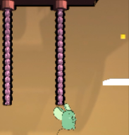 | 4 |
| 2 | 2, 3 | A | The speed of climbing the rope is too slow | 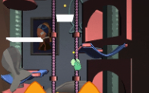 | 2 |
| 3 | 1 | A, C | No background music at the start scene |  | 1 |
| 4 | 1, 2, 3, 4 | C | The cheese is not obvious | 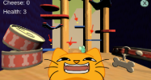 | 2 |
| 5 | 1, 2, 3, 4 | A, B, E | Players often get stuck at the start due to X-axis interaction issues | 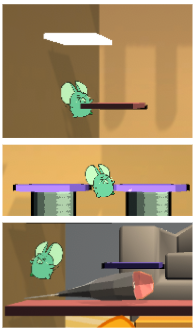 | 5 |
| 6 | 1, 2, 3, 4 |  | Hard to see cheese on yellow background | 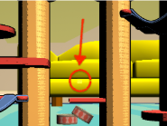 | 3 |
| 7 | 1, 2, 3, 4 | A, B | The hitbox of the cheese feels too hard to get |  | 3 |
| 8 | 4 | A, B, C, E | The player clips through the platform at the end of level | 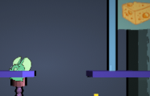 | 2 |
| 9 | 1 | B, C, E | Help button is misleading | 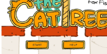 | 2 |
| 10 | 2, 3, 4 | A, B, C | The breaking platforms and bounce pads are not well telegraphed |  | 4 |
| 11 | 2, 3 | B, C | Sometimes the cheese gives double points and plays sound effect twice when collected |  | 4 |
| 12 | 1, 2 | A, B, C | Players don’t realise that holding jump makes them go higher |  | 5 |
| 13 | 1, 2, 3, 4 | A, B, C, E | Cat seemed like a threat at the start but players realised that it could not do damage |  | 3 |
| 14 | 2, 3, 4 | A, B, C, E | The rope climbing was unreliable and would sometimes soft-lock the player from progressing, whether through getting stuck on a specific section or no longer being collidable. |  | 5 |

### 2. Findings

   Overall, the game largely achieves the platformer genre's expected balance of being “easy to pick up, hard to master”. Its music and pacing effectively build tension. However, the external drive to “progress upwards” could be strengthened (e.g., through the cat's pursuit rhythm and a heightened sense of visible threat), thereby reducing stationary experimentation and fruitless exploration.   
   This evaluation round, conducted with all participants covering Tasks 1–4, identified 14 issues primarily clustered into four areas: rope-X axis interaction, collision and yarn hit detection, target legibility and scoring accuracy, and initial screen/menu/default volume settings. Table 4  consolidates these results and serves as the basis for subsequent analysis.  
   

Table 4\. Summary of findings

| Category | Summary of Participant Responses | Design Implications/notes |
| :---- | :---- | :---- |
| **Goal understanding** | **80% participants correctly identified that the aim was to go up and somehow reach the top**  | Add more pressure especially from the cat enemy to drive the player up |
| **Controls and movement** | 60% participants used wasd and space 40% participants used arrow keys but their keyboard had some issues that caused confusion 60% participants said jumping felt slightly delayed and movement was a little slippery, hard to time on moving platforms.” | Need to implement a tutorial screen explaining controls Most played platformers before and thought the controls were simple and easy to use considering there were only 5 buttons and in a standard configuration But player collision and speed need to be tweaked (slower) |
| **Feedback and cues** | All participants thought it was easy to tell that the yarn balls deal damage so they naturally dodged, and they could easily tell that the cheese was a collectible from visuals and sound effects Most liked that the platforms are colour coded but expert participants suggested adding a section for them in the tutorial and clearer sfx for each platform 40% participants said didn’t know what each platform did immediately but liked discovering the new platform mechanics 80% participants identified that the music and sound effects were too loud | Strengthen visual/audio feedback when a mechanism is triggered. (especially for the platforms) Lower volume |
| **Difficulty and Flow** | 80% participants thought the game difficulty was fine and they discovered some pathways were red herrings and didn't lead to progression, but were fine with that. They infer from this game making you reset to the start with no checkpoints that you are supposed to play through multiple times and learn the level layout. However, almost every participants experience softlocking bugs that made them restart  | We’ll keep the design decision to not have checkpoints to encourage players to trial and error and memorise the level Some major mechanics like rope climbing will need significant debugging |

### 3. What we improved

   To facilitate traceability and verification, all subsequent modifications are indexed and consolidated using the Issue \# from Table 3\. When reviewing Table 5, please cross-reference the issue descriptions and severity ratings in Table 3 for verification.  
     
   Table 5\. The changes we made

| Issue \# | How to improved | Screenshot |
| ----- | ----- | ----- |
| **1, 2** | Adjust the speed and replace the animation | 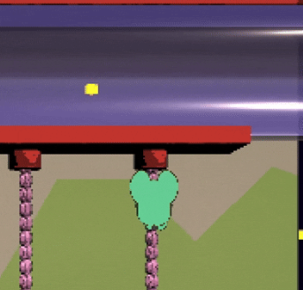 |
| **3** | Music was added to intro screen |  |
| **4, 6, 7** | Double the size of cheese pickups | 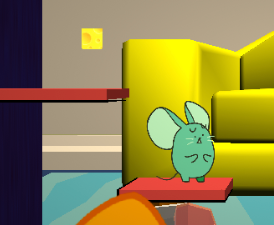 |
| **5** | Made the player hitbox smaller |  |
| **8** | Provided another platform as another path option, but otherwise left it as intentional |  |
| **9** | Renamed the button text to ‘Tutorial’ | 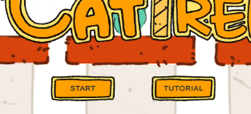 |
| **10** | Added appropriate sound effects to different platform types, and increased the shaking intensity of breaking platforms |  |
| **11** | Collectible script bug fixed |  |
| **12** | Added more explanation about jump mechanics in the Tutorial (i.e. Help) screen | 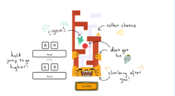 |
| **13** | The cat had not been fully implemented during user tests, and now does damage to the player while climbing slowly up the level. | 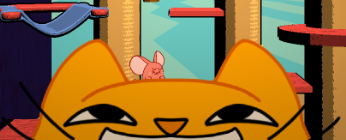 |
| **14** | We had tried to iterate and debug the rope climbing script, but it took many attempts. In the end, some key bugs were a) a race condition between player triggers on attaching and detaching the rope, a) ropes are segmented and the colliders were processed separately, causing the player to get stuck, and c) logic errors in the ignoreRopeCoroutine that would permanently disable collisions.   |  |

###  

### 4. Limitations

* Due to time constraints, we made changes while conducting tests. Consequently, not every participant tested the same version of the game.  
* Due to time constraints, this repair prioritised feasibility over achieving an optimal solution.  
* The limited duration and number of testing rounds prevented thorough regression testing and exploratory interviews, resulting in insufficient depth in uncovering the causal chains for certain issues.  
* We did not implement measures to avoid the Hawthorne effect (Tang et al., 2024). In observed or recorded scenarios, participants may become more cautious, thereby altering their natural gameplay behaviour.  
* Specialised testing for users with colour vision deficiency, low vision, hearing impairments, or motor disabilities has not yet been systematically incorporated. Findings regarding colour contrast and redundant feedback channels (visual/auditory/tactile) require further validation.

   
#
## Shaders and Special Effects {#shaders-and-special-effects}

This section showcases two custom shaders and a particle effects system developed for Climb the Cat Tree. All implementations are based on Unity's Vertex–Fragment Rendering Pipeline, using GPU-led per-pixel lighting and effects rendering to enhance the game's expressiveness while reducing CPU computational load. These visual solutions embody the approach of using rendering logic to support the game's narrative, making lighting, colour, and performance mechanisms as integral elements of the narrative language.

**Shaders**

**1\. ToonPhongWithOutline.shader**

* File path: `/Assets/Shaders/ToonPhongWithOutline.shader`

  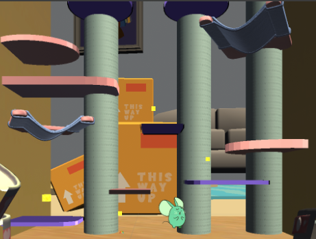

    Vs.    

  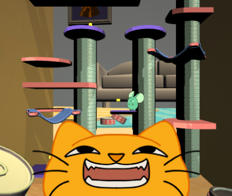

Purpose: Used for lighting and outline rendering on the main platforms and scene models, creating a 2.5D cartoon-style aesthetic.

**1.1 Design Concept & Implementation Overview**  
This shader is based on the Phong Reflection Model, calculating reflections and specular highlights at the fragment stage. Compared to standard surface shaders, this implementation preserves greater colour information at the pixel level, resulting in softer transitions between light and shadow on surfaces. Artistically, it embodies the principle that lighting is semantics, where the direction and intensity of light not only shape forms but also construct emotional atmospheres.

**1.2 Core Structure & Parameters**  
Pass 1 (Toon Lighting and Material Mapping):

* \_BaseMap controls base colour and texture detail  
* \_BumpMap and \_BumpScale implement normal mapping, enhancing the realism of materials like wood and fur  
* \_SaturationBoost increases highlight saturation, preventing cartoon styles from fading under intense light


Pass 2 (Outline Rendering):

* Generates black outlines through normal extrusion:  
  pos \= UnityObjectToClipPos(v.vertex \+ v.normal \* \_OutlineWidth \* 0.001)  
* Parameters \_OutlineColour and \_OutlineWidth control the outline colour and thickness respectively  
* The outline layer resides in the ‘Overlay’ render queue, always positioned on the outermost layer of the model to ensure characters remain clearly visible against complex backgrounds

**1.3 Material Integration & Flexibility**  
All parameters are exposed within Unity's Material Inspector panel for direct adjustment:

| Parameter Name | Function | Range |
| :---- | :---- | :---- |
| \_BaseMap | Control base texture | Any texture |
| \_BaseColor | Control overall tint | RGBA (0–1) |
| \_BumpScale | Normal intensity | 0–1 |
| \_SaturationBoost | Highlight saturation level | 0–1 |
| \_OutlineWidth | Stroke thickness | 0.5–16 pixels |

This parametric design enables the shader to be widely reused across different levels, and can be adapted to the game's visual gradient from warm to cool tones by adjusting colour temperature and saturation.

**1.4 Artistic & Technical**  
This shader aims to enhance character presence through stylised lighting and dual-layer outlines:

* Outlines ensure character visibility against complex layered backgrounds  
* Saturation control creates a dreamlike, luminous atmosphere  
* GPU computation offloads CPU load, ensuring smooth frame rates  
* A dual-pass rendering structure balances performance with artistic expression

Thus, ToonPhongWithOutline establishes the game's signature visual system of ‘soft lighting \- high saturation \- smooth outlines’, maintaining player immersion throughout climbing and collection sequences.

**2\. WaveShader.shader**

* File path: `/Assets/Shaders/WaveShader.shader`

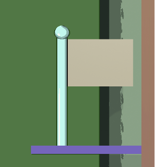

Purpose: Simulates the fluttering of a flag in the wind. By applying sinusoidal displacement during the vertex stage and overlaying an ‘amplitude decay towards the flagpole side’, the effect of ‘greater stability near the flagpole and increased oscillation at the far end’ is achieved.

**2.1 Design Concept & Implementation Overview**  
The flag serves as the checkpoint at the game's endpoint. We employ physics-inspired wave effects to animate the scene whilst maintaining rigidity near the flagpole, preventing excessive, unnatural jitter at its base. This shader utilises Unity's Vertex–Fragment pipeline, performing displacement solely within the vertex shader (on the GPU), thus avoiding additional CPU load. Additionally, the \_CustomMVP (provided by CustomMVP.cs) facilitates vertex-to-clipping-space transformations, enabling customisable rendering workflows and visual verification.

**2.2 Core Structure & Parameters**  
Pass \- single-pass vertex deformation and texture sampling

* Disable backface culling: Cull Off, to prevent visible seams when single-sided meshes swing.  
* Key vertex displacement:  
  ```
  // UV-based falloff: smaller amplitude near the pole side  
  float u \= v.uv.x;  
  u \= lerp(u, 1.0 \- u, step(0.5, \_PoleOnRight)); // flip if the pole is on the right  
    
  // Falloff curve  
  float attn \= pow(saturate(1.0 \- u), \_Falloff); // larger \_Falloff \=\> “stiffer” near the pole  
    
  // Final amplitude  
  float amp \= \_MaxAmp \* attn; // max amplitude at free end \* falloff  
    
  // Sine displacement  
  float wave \= sin(v.vertex.x \* \_Freq \+ \_Time.y \* \_Speed);  

  v.vertex.y \+= amp \* wave;
  ```
* **Fragment stage:** tex2D(\_MainTex, i.uv)texture sampling only.

**2.3 Material Integration & Flexibility**  
All parameters are exposed within Unity's Material Inspector panel for direct adjustment:

| Parameter Name | Function | Range |
| :---- | :---- | :---- |
| \_MainTex | Flag texture | Any texture |
| \_MaxAmp | Maximum amplitude at free end | 0–5 (in model units) |
| \_Freq | Spatial frequency (waves per unit) | 0.5–3 (raise with denser meshes) |
| \_Speed | Temporal speed (animation rate) | 0–3 |
| \_Falloff | Steepness of pole-side falloff (power) | 0–4 (higher \= “stiffer” near pole) |
| \_PoleOnRight | Is the pole on the right? (0/1) | 0 \= left, 1 \= right |

This parametric design facilitates adjustments to the shader by other members of the team.

**2.4 Artistic & Technical**  
This shader aims to depict relatively realistic flag fluttering in the wind:

* The contrast between the “rigid” pole side and the “flexible” far end enhances the authentic sensation of a “fixed point—free end” mechanism  
* A sufficiently subdivided mesh avoids a “jagged” appearance, better rendering the undulating fabric  
* This is a visual deformation, involving only vertex displacement, thus resulting in low GPU cost

WaveShader employs a core technique of ‘UV-guided amplitude attenuation combined with vertex sine displacement’, delivering more realistic flag-surface animations with minimal additional rendering overhead.

**Particle System**

**1\. VFX\_CheesePickup**

* File Path: `/Assets/VFX/VFX\_CheesePickup.prefab`  
* Associated Script: `/Assets/VFX/AutoDestroyVFX.cs`
    
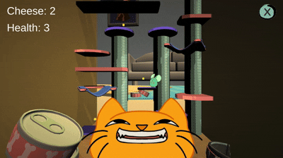


Purpose: Triggers an explosion particle effect when the player picks up cheese, providing immediate visual response and a scoring prompt.

**1.1 Technical Logic**  
This system utilises Unity's GPU-based Particle System. The trigger condition is the collision between the character and the cheese (OnTriggerEnter). The operational logic is as follows:

* Generate approximately 25 particles with velocities randomly distributed between 0.8 and 1.3  
* Colours transition from bright yellow to transparent  
* The Gravity Modifier is set to 0.2, creating a sensation of light, floating descent  
* The AutoDestroyVFX.cs script destroys the object after the particle sequence concludes:  
```
  if (ps \!= null && \!ps.IsAlive())  
  {  
   Destroy(gameObject);  
  }
```

This mechanism ensures automatic resource reclamation, preventing residual objects from repeated effect triggers and enhancing runtime performance.

**1.2 Visual & Narrative Effect**

* Particles adopt the same yellow hue as the cheese body, establishing visual consistency  
* The burst moment symbolises ‘energy release’, amplifying the player's sense of achievement  
* The fade-out effect conveys the emotional rhythm of ‘instant joy’, echoing the game's overall tension  
* The effect gently expands from the screen's centre, remaining eye-catching without disrupting primary actions

This effect embodies the design concept that visual response constitutes an interactive language. Through vibrant colours and spatial motion, it heightens the satisfaction of collection actions while enabling players to quickly determine successful collection.

#
## Summary of Contributions {#summary-of-contributions}

| Name | Contributions |
| :---- | :---- |
| Qinghao | - Modelling components for cat trees and platforms ([Model file](https://github.com/feit-comp30019/2025s2-project-2-fox-fish/tree/main/Assets/Model)) <br> - Material balls setup ([Materials file](https://github.com/feit-comp30019/2025s2-project-2-fox-fish/tree/main/Assets/Materials)) <br> - Flag shader ([WaveShader.shader](https://github.com/feit-comp30019/2025s2-project-2-fox-fish/blob/main/Assets/Shaders/WaveShader.shader)) & Vignette shader ([FitQuadToCamera.cs](https://github.com/feit-comp30019/2025s2-project-2-fox-fish/blob/main/Assets/dark%20corner/FitQuadToCamera.cs), [VignetteProgressDriver \_](https://github.com/feit-comp30019/2025s2-project-2-fox-fish/blob/main/Assets/dark%20corner/VignetteProgressDriver%20_%20MonoBehaviour.cs) [MonoBehaviour.cs](http://MonoBehaviour.cs), [dark corner.png](https://github.com/feit-comp30019/2025s2-project-2-fox-fish/blob/main/Assets/dark%20corner/dark%20corner.png), [DarkCornerOverlay.shader](https://github.com/feit-comp30019/2025s2-project-2-fox-fish/blob/main/Assets/Materials/DarkCornerOverlay.shader))<br> - Basic UI ([StartGame.cs](https://github.com/feit-comp30019/2025s2-project-2-fox-fish/blob/main/Assets/UI/StartGame.cs), [QuitButton.cs](https://github.com/feit-comp30019/2025s2-project-2-fox-fish/blob/main/Assets/UI/QuitButton.cs), [Quit.cs](https://github.com/feit-comp30019/2025s2-project-2-fox-fish/blob/main/Assets/UI/Quit.cs), [Finish.cs](https://github.com/feit-comp30019/2025s2-project-2-fox-fish/blob/main/Assets/UI/Finish.cs)) <br> - Evaluation plan (include Appendix 1, 2, 3\) <br> - User testing (interview) <br> - Sound effects (modify some corresponding scripts; [LongPressBoostSFX.cs](https://github.com/feit-comp30019/2025s2-project-2-fox-fish/blob/main/Assets/level-mechanics/Jump%20Platform/LongPressBoostSFX.cs)) <br> - Update final GDD <br> - Update final report (The overall framework of the Evaluation Report; Findings & Limitations in Evaluation Report; WaveShader.shader in Shaders and Special Effects) |
| Xinyu | - ToonPhongWithOutline shader ([ToonPhongWithOutline.shader](https://github.com/feit-comp30019/2025s2-project-2-fox-fish/blob/main/Assets/Shaders/ToonPhongWithOutline.shader)) <br> - Glow shader ([Glow.shader](https://github.com/feit-comp30019/2025s2-project-2-fox-fish/blob/main/Assets/Shaders/Glow.shader)) <br> - Cheese effect particle system ([VFX\_CheesePickup](https://github.com/feit-comp30019/2025s2-project-2-fox-fish/tree/main/Assets/VFX)) <br> - Height-based colour gradient system <br> -  Jump pad ([Jump Platform](https://github.com/feit-comp30019/2025s2-project-2-fox-fish/tree/main/Assets/level-mechanics/Jump%20Platform)) <br> - Climb rope ([Climb rope](https://github.com/feit-comp30019/2025s2-project-2-fox-fish/tree/main/Assets/level-mechanics/Climb%20Rope)) <br> - Yarn ball projectile ([YarnBall Projectile](https://github.com/feit-comp30019/2025s2-project-2-fox-fish/tree/main/Assets/level-mechanics/YarnBall%20Projectile)) <br> - Level design <br> - Some debugging and modifications, with version iterations <br> - Update final GDD <br> - Update final report |
| Cindy | - Player movement ([playerController.cs](http://Assets/level-mechanics/playerController.cs)) <br> - Camera movement ([CameraFollow.cs](https://github.com/feit-comp30019/2025s2-project-2-fox-fish/blob/main/Assets/level-mechanics/CameraFollow.cs)) <br> - Level design Player (mouse) animations ([Animation Files](https://github.com/feit-comp30019/2025s2-project-2-fox-fish/tree/main/Assets/Animation%20Files)) <br> - Enemy (cat) animations ([Animation Files/cat](https://github.com/feit-comp30019/2025s2-project-2-fox-fish/tree/main/Assets/Animation%20Files/cat)) <br> - Intro sequence animation ([StreamingAssets](https://github.com/feit-comp30019/2025s2-project-2-fox-fish/tree/main/Assets/StreamingAssets))<br> -  Art for tutorial screen 2D art assets ([Animation Files](https://github.com/feit-comp30019/2025s2-project-2-fox-fish/tree/main/Assets/Animation%20Files))<br> -  Initial game concept Sound design User testing (PTW)<br> -  Debugging Gameplay video ([YouTube link here](https://youtu.be/S4M9nd9d5Bo)) <br> - GDD (Game overview, basic production pipeline, mechanics) <br> - Update final report |
| Emily | - Hosting user testing web builds ([Github Page here](https://emiwooo.github.io/comp30019-user-testing/)) <br> - Debugging Github repository setup and help <br> - User testing (PTW) <br> - Player points and health logic ([PlayerInfo.cs](https://github.com/feit-comp30019/2025s2-project-2-fox-fish/blob/main/Assets/level-mechanics/PlayerInfo.cs)) <br> - Rising cat head at bottom of level ([RisingCat](https://github.com/feit-comp30019/2025s2-project-2-fox-fish/tree/main/Assets/level-mechanics/RisingCat))<br> -  Breaking and moving platforms ([MovingPlatform.cs](https://github.com/feit-comp30019/2025s2-project-2-fox-fish/blob/main/Assets/level-mechanics/MovingPlatform.cs), [BreakingPlatform.cs](https://github.com/feit-comp30019/2025s2-project-2-fox-fish/blob/main/Assets/level-mechanics/BreakingPlatform.cs)) <br> - Collectible cheese ([Collectible.cs](https://github.com/feit-comp30019/2025s2-project-2-fox-fish/blob/main/Assets/level-mechanics/Collectible.cs)) <br> - Swiping cat paw ([CatPawSwipe.cs](https://github.com/feit-comp30019/2025s2-project-2-fox-fish/blob/main/Assets/level-mechanics/CatPawSwipe.cs)) <br> - Event-driven rehauls to UI logic ([HealthUI.cs](https://github.com/feit-comp30019/2025s2-project-2-fox-fish/blob/main/Assets/UI/HealthUI.cs), [CheeseUI.cs](https://github.com/feit-comp30019/2025s2-project-2-fox-fish/blob/main/Assets/UI/CheeseUI.cs)) <br> - End star display for number of points player received ([WinPanelManager.cs](https://github.com/feit-comp30019/2025s2-project-2-fox-fish/blob/main/Assets/UI/WinPanelManager.cs)) <br> - UI implementation and minor UI assets  <br> - Converting documents to .md for submission <br> - Updating GDD and Report <br> - Jira board setup |

#
## References and External Resources {#references-and-external-resources}

FAIR Consulting Group. (2021). *Using System Usability Scale and Post-Task Walkthrough to Test Usability and Functionality of Systems*. Available at: [https://faircg.com/code-stories/using-system-usability-scale-and-post-task-walkthrough-to-test-usability-and-functionality-of-systems/\#elementor-toc\_\_heading-anchor-5](https://faircg.com/code-stories/using-system-usability-scale-and-post-task-walkthrough-to-test-usability-and-functionality-of-systems/#elementor-toc__heading-anchor-5).

Jennings, G.R. (2005). *Semistructured Interview \- an overview | ScienceDirect Topics*. www.sciencedirect.com. Available at: [https://www.sciencedirect.com/topics/psychology/semistructured-interview](https://www.sciencedirect.com/topics/psychology/semistructured-interview).

Nielsen, J. (1994). *10 Heuristics for User Interface Design*. Nielsen Norman Group. Available at: [https://www.nngroup.com/articles/ten-usability-heuristics/](https://www.nngroup.com/articles/ten-usability-heuristics/).

Nielsen, J. (2000, March 18). Why You Only Need to Test with 5 Users. *Nielsen Norman Group.* [https://www.nngroup.com/articles/why-you-only-need-to-test-with-5-users/](https://www.nngroup.com/articles/why-you-only-need-to-test-with-5-users/)‌

Tang, H., Lee, B.G., Towey, D., Chen, K., Fang, Y., Zhang, R. and Pike, M. (2024). The Audience Effect: Do Observations Change Outcomes in HCI Studies? *2022 IEEE 46th Annual Computers, Software, and Applications Conference (COMPSAC)*, pp.611–620. doi:[https://doi.org/10.1109/compsac61105.2024.00088](https://doi.org/10.1109/compsac61105.2024.00088).

#
## Appendix 1: Consent Form

**What is the project about?** We are conducting user research to evaluate a platform-jumping game prototype (Climb the Cat Tree) developed by a student team. This study aims to understand players' genuine experiences with the tutorial, controls, feedback, and difficulty pacing, while identifying usability and user experience issues. During the session, you will complete several tasks, followed by reviewing short clips and discussing your impressions with the researcher. If you don’t mind spending 30 minutes with us, we would greatly appreciate your help\!

**May we have your permission to record?** Sometimes, it is difficult to recall accurately what you said during the evaluation. Thus, we would like to get your permission to audio and screen record you in our study. The purpose of this is to help us remember better, so that we can base our conclusions on an accurate understanding of your words and actions. If you agree to our private use of the recordings, in no circumstance would your words or image be used in a commercial setting without first contacting you for permission.

**One last note…** We would like to let you know that we are grateful for your help in our study. However, if at any point during the study you feel like stopping, please let us know. Your participation is totally voluntary and no questions will be asked for your withdrawal.

**May we have your consent?**

☐Yes, I agree to participate in this study and grant permission to use the audio and screen recording of this interview for internal project purposes.

Name: \_\_\_\_\_\_\_\_\_\_\_\_\_\_\_\_\_\_\_\_\_\_\_\_\_\_\_\_\_\_\_\_\_\_\_\_\_\_\_\_\_\_\_\_\_\_

Signed: \_\_\_\_\_\_\_\_\_\_\_\_\_\_\_\_\_\_\_\_\_\_\_\_\_\_\_\_\_\_\_\_\_\_\_\_\_\_\_\_\_\_\_\_\_\_

Date: \_\_\_\_\_\_\_\_\_\_\_\_\_\_\_\_\_\_\_\_\_\_\_\_\_\_\_\_\_\_\_\_\_\_\_\_\_\_\_\_\_\_\_\_\_\_\_\_

#
## Appendix 2: Template for Post-task Walkthrough Notes (per participant)

**Table 1\. Basic information**

| Participant | Device | Self-Reported Level (Novice/Intermediate/Advanced) | Handedness (Right / Left / Both) | Date |
| :---- | :---- | :---- | :---- | :---- |
|  |  |  |  |  |

**Table 2\. Behaviour Data**

| First success time (s) | Task 1: <br>Task 2: <br>Task 3: <br>Task 4: |
| :---- | :---- |
| Total time (s) | Task 1: <br>Task 2: <br>Task 3: <br>Task 4: |
| Number of attempts | Task 1: <br>Task 2: <br>Task 3: <br>Task 4: |

**Table 3\. Process notes**
Observation Dimensions:
Key events: Falls/impacts/stuck points, route alterations, repeated tentative attempts, pauses, abandoned attempts  
Body language: Noticeable forward/backward leaning, deep breathing, whispered comments  
Micro-expressions: Sighs/frowning/surprise reactions

| Task ID | Event type | Reply notes |
| :---- | :---- | :---- |
|  |  |  |
|  |  |  |
|  |  |  |
|  |  |  |
|  |  |  |

#
## Appendix 3: Interview Questions

Important Notes: Respect and protect the privacy of interviewees. Request permission to retain audio and written materials.

**Part A: Basic information (before doing the tasks)**  
1\. Platformer Level (Novice / Intermediate / Advanced)  
2\. Primary Device  
3\. Frequency of playing games over the last months. ( 0/ 0-5/ 5-10/ \>10)  
4\. Handedness (Right / Left / Both)  
5\. How confident are you in judging the correct timing for jumps? (0: not at all; 5: very)  
6\. What were your expectations of this type of platformer game before you started?

**Part B: Core questions**  
**Visibility of system status**  
1\. When you collect cheese or lose health, can you immediately know the outcome? What feedback do you rely on to know?

2\. Do you like the current placement of the score and health bars?

**Match between system and the real world**  
3\. Are the icons, naming conventions, and symbols in the game intuitive? 
- No: If you were to choose a more natural name/icon, what would it be?

**User control and freedom**  
4\. Do you have any means of recovery after an erroneous operation, do you want to include any (such as a quick redo or returning to a checkpoint)?

**Consistency and standards**  
5\. Does the control key mapping suit your preferences? Which element deviates from common standards, leading to errors?  
- Unfamiliar: If you could change just one key, which one would you alter?

**Error prevention**  
6\. In which situations are users most prone to accidental touches or misjudging the timing? 
- At which stage would you prefer an earlier or more prominent warning?

7\. In which scenarios would providing a prompt or secondary confirmation prove most beneficial?

## Recognition Rather than Recall

8\. Are the prompts during operation enough? Are there moments when one must rely on memory?  
- At which point were prompts most needed? What kind of prompts were required?

**Aesthetic and minimalist design**  
9\. Is the screen information just right? At what points is there too much/too little information, or does it obstruct or distract?  
If you could remove or add just one layer of information, where would you choose?

**Help and documentation**  
10\. If you forget a particular operation or mechanism, do you know where to quickly find the answer?  

